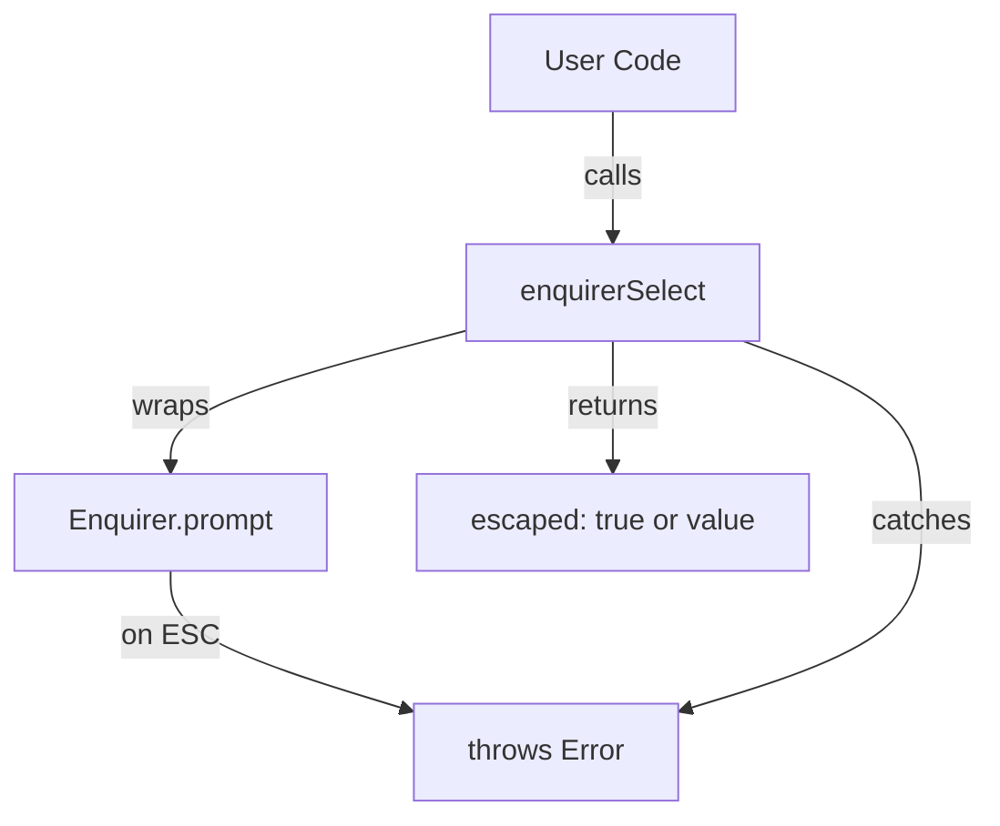

# Migration Plan: @inquirer/prompts to enquirer

## Overview

The POC testing confirmed that `enquirer` handles ESC navigation cleanly without requiring complex screen clearing logic. This migration will replace the current `@inquirer/prompts` + `promptWithEscape` wrapper approach with `enquirer`'s native ESC handling.

## Why Migrate?

### Current Issues
- Screen overlap when pressing ESC due to timing between `@inquirer/prompts` rendering and manual clearing
- Complex `promptWithEscape.ts` wrapper with AbortController, raw mode, keypress detection
- Race conditions between `console.clear()`, `process.stdout.write('\x1B[2J\x1B[0f')`, and prompt rendering
- Manual clearing logic scattered across multiple files

### Enquirer Benefits
- Native ESC support - throws error when ESC is pressed
- Built-in screen management - no manual clearing needed
- Simpler API - just wrap in try/catch
- No timing issues or race conditions

## Current Architecture

```mermaid
graph TD
    A[User Code] -->|calls| B[selectWithEscape]
    B -->|wraps| C[@inquirer/prompts select]
    B -->|manages| D[EscapeKeyManager]
    D -->|sets up| E[Raw Mode + Keypress]
    D -->|manages| F[AbortController]
    E -->|on ESC| G[abort + cleanup]
    G -->|manual| H[process.stdout.write clear]
    H -->|then| I[resolve escaped: true]
    
    J[Loop Code] -->|after return| K[process.stdout.write clear]
    K -->|race with| C
```

## Target Architecture



## Scope of Changes

### Files to Modify (10 source files)

1. **`src/utils/promptWithEscape.ts`** - Complete rewrite
   - Current: 171 lines with complex ESC handling
   - Target: ~80 lines with simple enquirer wrappers
   
2. **`src/services/contacts/contactEditor.ts`** - 24 prompt calls
   - Replace `selectWithEscape`, `inputWithEscape`, `checkboxWithEscape`
   - No logic changes, just API adaptation

3. **`src/scripts/eventsJobsSync.ts`** - 29 prompt calls
   - Highest usage in codebase
   - Replace all prompt functions

4. **`src/services/contacts/eventsContactEditor.ts`** - 9 prompt calls
5. **`src/services/contacts/duplicateDetector.ts`** - 2 prompt calls  
6. **`src/scripts/contactsSync.ts`** - 2 prompt calls
7. **`src/scripts/linkedinSync.ts`** - 2 prompt calls
8. **`src/index.ts`** - 2 prompt calls
9. **`src/utils/__tests__/promptWithEscape.test.ts`** - Update tests
10. **`src/scripts/__tests__/eventsJobsSync.test.ts`** - Update tests

### Manual Clearing to Remove

Remove all `process.stdout.write('\x1B[2J\x1B[0f')` calls from:
- `src/utils/promptWithEscape.ts` (lines 60, 87)
- `src/scripts/contactsSync.ts` (lines 106, 130, 139, 220, 236)
- `src/services/contacts/contactEditor.ts` (lines 206, 857)

### Dependencies

**Remove:**
- `@inquirer/prompts` (currently ^8.3.2)

**Keep:**
- `enquirer` (already installed: ^2.4.1)

## Implementation Steps

### Step 1: Create New promptWithEnquirer Utility

Create simplified wrapper functions matching the current API but using `enquirer`:

```typescript
// src/utils/promptWithEnquirer.ts
import Enquirer from 'enquirer';

export type PromptResult<T> = 
  | { escaped: true }
  | { escaped: false; value: T };

async function enquirerPrompt<T>(
  promptConfig: any,
  choices?: Array<{ name?: string; value: T }>
): Promise<PromptResult<T>> {
  try {
    const enquirer = new Enquirer();
    const result: any = await enquirer.prompt(promptConfig);
    const selectedText = result[promptConfig.name];
    
    // Map text back to value if choices provided
    if (choices && promptConfig.type === 'select') {
      const choice = choices.find(c => (c.name || String(c.value)) === selectedText);
      return { escaped: false, value: choice ? choice.value : selectedText as T };
    }
    
    return { escaped: false, value: selectedText as T };
  } catch (error) {
    return { escaped: true };
  }
}

export interface SelectChoice<T = string> {
  name?: string;
  value: T;
  description?: string;
  disabled?: boolean | string;
}

export interface SelectConfig<T = string> {
  message: string;
  choices: ReadonlyArray<SelectChoice<T>>;
  default?: T;
  loop?: boolean;
  pageSize?: number;
}

export async function selectWithEscape<T = string>(
  config: SelectConfig<T>
): Promise<PromptResult<T>> {
  const choiceNames = config.choices.map(c => c.name || String(c.value));
  const defaultIndex = config.default 
    ? config.choices.findIndex(c => c.value === config.default)
    : 0;
    
  return enquirerPrompt<T>(
    {
      type: 'select',
      name: 'value',
      message: config.message,
      choices: choiceNames,
      initial: defaultIndex >= 0 ? defaultIndex : 0,
    },
    config.choices as Array<{ name?: string; value: T }>
  );
}

export interface InputConfig {
  message: string;
  default?: string;
  validate?: (input: string) => boolean | string | Promise<boolean | string>;
  transformer?: (input: string, context: { isFinal: boolean }) => string;
}

export async function inputWithEscape(
  config: InputConfig
): Promise<PromptResult<string>> {
  return enquirerPrompt<string>({
    type: 'input',
    name: 'value',
    message: config.message,
    initial: config.default || '',
    validate: config.validate as any,
  });
}

export interface ConfirmConfig {
  message: string;
  default?: boolean;
  transformer?: (value: boolean) => string;
}

export async function confirmWithEscape(
  config: ConfirmConfig
): Promise<PromptResult<boolean>> {
  try {
    const enquirer = new Enquirer();
    const result: any = await enquirer.prompt({
      type: 'confirm',
      name: 'value',
      message: config.message,
      initial: config.default ?? false,
    });
    return { escaped: false, value: result.value };
  } catch (error) {
    return { escaped: true };
  }
}

export interface CheckboxChoice<T = string> {
  name?: string;
  value: T;
  checked?: boolean;
  disabled?: boolean | string;
}

export interface CheckboxConfig<T = string> {
  message: string;
  choices: ReadonlyArray<CheckboxChoice<T>>;
  loop?: boolean;
  pageSize?: number;
  validate?: (items: T[]) => boolean | string | Promise<boolean | string>;
}

export async function checkboxWithEscape<T = string>(
  config: CheckboxConfig<T>
): Promise<PromptResult<T[]>> {
  try {
    const enquirer = new Enquirer();
    const choiceConfigs = config.choices.map(c => ({
      name: c.name || String(c.value),
      value: c.name || String(c.value),
      enabled: c.checked || false,
    }));
    
    const result: any = await enquirer.prompt({
      type: 'multiselect',
      name: 'value',
      message: config.message,
      choices: choiceConfigs,
      validate: config.validate as any,
    });
    
    // Map selected names back to values
    const selectedNames = result.value as string[];
    const selectedValues = selectedNames.map(name => {
      const choice = config.choices.find(c => (c.name || String(c.value)) === name);
      return choice ? choice.value : name as unknown as T;
    });
    
    return { escaped: false, value: selectedValues };
  } catch (error) {
    return { escaped: true };
  }
}

export function resetEscapeManagerForTesting(): void {
  // No-op for compatibility - enquirer doesn't need singleton management
}
```

**Key Differences:**
- No `EscapeKeyManager` singleton
- No raw mode or keypress detection
- No `AbortController`
- No manual screen clearing
- Simple try/catch pattern
- Choice value mapping handled internally

### Step 2: Update Import Statements

Replace in all 10 files:

```typescript
// OLD
import { selectWithEscape, inputWithEscape, confirmWithEscape, checkboxWithEscape } from '../utils/promptWithEscape';

// NEW  
import { selectWithEscape, inputWithEscape, confirmWithEscape, checkboxWithEscape } from '../utils/promptWithEnquirer';
```

**API Compatibility:**
The new functions maintain the exact same signature, so no logic changes needed:

```typescript
// Both return Promise<PromptResult<T>>
const result = await selectWithEscape({ message: '...', choices: [...] });
if (result.escaped) { /* handle ESC */ }
const value = result.value;
```

### Step 3: Remove Manual Clearing Logic

**Files to clean:**

1. **`src/scripts/contactsSync.ts`**
   - Remove line 106: `process.stdout.write('\x1B[2J\x1B[0f');` (mainMenu loop start)
   - Remove line 130: after `syncContactsFlow()`
   - Remove line 139: after `addContactFlow()`
   - Remove line 220: after `collectInitialInput()`
   - Remove line 236: in catch block

2. **`src/services/contacts/contactEditor.ts`**
   - Remove line 206: `process.stdout.write('\x1B[2J\x1B[0f');` (showSummaryAndEdit loop)
   - Remove line 857: (promptForLabels loop)

**Rationale:** Enquirer manages its own rendering, so these clears are unnecessary and cause flickering.

### Step 4: Update Tests

**`src/utils/__tests__/promptWithEscape.test.ts`:**
- Rename to `promptWithEnquirer.test.ts`
- Update imports to use `promptWithEnquirer`
- Simplify tests - no need to test raw mode, keypress, AbortController
- Focus on: ESC returns `escaped: true`, normal selection returns value
- Mock `Enquirer.prototype.prompt` instead of `@inquirer/prompts`

Example test structure:
```typescript
import { vi, describe, it, expect, beforeEach } from 'vitest';
import Enquirer from 'enquirer';
import { selectWithEscape, inputWithEscape } from '../promptWithEnquirer';

vi.mock('enquirer');

describe('promptWithEnquirer', () => {
  beforeEach(() => {
    vi.clearAllMocks();
  });

  it('should return escaped: true when user presses ESC', async () => {
    vi.spyOn(Enquirer.prototype, 'prompt').mockRejectedValue(new Error('cancelled'));
    
    const result = await selectWithEscape({
      message: 'Choose:',
      choices: [{ name: 'A', value: 'a' }],
    });
    
    expect(result.escaped).toBe(true);
  });

  it('should return value when user makes selection', async () => {
    vi.spyOn(Enquirer.prototype, 'prompt').mockResolvedValue({ value: 'Option A' });
    
    const result = await selectWithEscape({
      message: 'Choose:',
      choices: [{ name: 'Option A', value: 'a' }],
    });
    
    expect(result.escaped).toBe(false);
    expect(result.value).toBe('a');
  });
});
```

**`src/scripts/__tests__/eventsJobsSync.test.ts`:**
- Update mocks to use enquirer
- Replace `@inquirer/prompts` mocks with `Enquirer.prototype.prompt` mocks
- No logic changes needed

### Step 5: Remove Old Files

After migration is complete and tested:
1. Delete `src/utils/promptWithEscape.ts`
2. Run `pnpm remove @inquirer/prompts`
3. Verify build succeeds: `pnpm build`
4. Verify tests pass: `pnpm test`

### Step 6: Update Documentation

Update these existing doc files to reflect the new approach:
- `docs/ESC_NAVIGATION_IMPLEMENTATION_PLAN.md` - Mark as superseded
- `docs/ESC_IMPLEMENTATION_COMPLETE.md` - Update with new implementation
- `docs/ESC_NAVIGATION_QUICK_REFERENCE.md` - Update usage examples

Create new:
- `docs/ENQUIRER_MIGRATION_SUMMARY.md` - Document what changed and why

## Testing Strategy

### Unit Tests
1. Test new `promptWithEnquirer` functions
2. Verify ESC returns `{ escaped: true }`
3. Verify normal input returns `{ escaped: false, value }`
4. Test choice value mapping for select/checkbox

### Integration Tests
1. Run each script and test ESC at every prompt
2. Verify no screen overlap
3. Verify no flickering
4. Test nested flows (e.g., add contact → edit → ESC → ESC)

### Manual Testing Checklist
- [ ] Main menu → ESC exits cleanly
- [ ] Contacts Sync → Add contact → ESC at labels → clean return
- [ ] Contacts Sync → Add contact → ESC at name input → clean return
- [ ] Contacts Sync → Add contact → complete flow → ESC at summary → clean return
- [ ] Contacts Sync → Add contact → edit email → ESC → clean return
- [ ] Events/Jobs Sync → ESC at various prompts
- [ ] LinkedIn Sync → ESC navigation
- [ ] Ctrl+C force quit works everywhere
- [ ] No screen overlap anywhere
- [ ] No flickering during transitions

## File-by-File Migration Order

### Phase 1: Foundation (Critical Path)
1. Create `src/utils/promptWithEnquirer.ts`
2. Update `src/utils/__tests__/promptWithEscape.test.ts` → rename and modify
3. Run tests to verify wrapper works

### Phase 2: Core Services (Most Complex)
4. Update `src/services/contacts/contactEditor.ts` (24 usages + 2 clears)
5. Update `src/scripts/eventsJobsSync.ts` (29 usages)
6. Update `src/services/contacts/eventsContactEditor.ts` (9 usages)
7. Test thoroughly after each file

### Phase 3: Supporting Files (Lower Risk)
8. Update `src/services/contacts/duplicateDetector.ts` (2 usages)
9. Update `src/scripts/contactsSync.ts` (2 usages + 5 clears)
10. Update `src/scripts/linkedinSync.ts` (2 usages)
11. Update `src/index.ts` (2 usages)
12. Update `src/scripts/__tests__/eventsJobsSync.test.ts`

### Phase 4: Cleanup
13. Delete `src/utils/promptWithEscape.ts`
14. Run `pnpm remove @inquirer/prompts`
15. Update documentation

## Rollback Plan

If issues arise during migration:

1. **Before deleting old files:** Keep `promptWithEscape.ts` until all files are migrated
2. **Git checkpoints:** Commit after each phase
3. **Testing gates:** Don't proceed to next phase if tests fail
4. **Quick rollback:** If major issues, revert to commit before migration started

## Risks and Mitigations

### Risk 1: Enquirer choice API differs from inquirer
- **Mitigation:** Wrapper maintains same API, handles mapping internally
- **Tested in POC:** Confirmed working

### Risk 2: Some advanced inquirer features not available in enquirer
- **Mitigation:** Audit current usage - we only use basic select/input/confirm/checkbox
- **Status:** No advanced features detected

### Risk 3: Different validation error display
- **Mitigation:** Test all validators, adjust messages if needed
- **Impact:** Low - validators are simple

### Risk 4: Enquirer may have different keyboard shortcuts
- **Mitigation:** Test thoroughly, document any differences
- **Status:** ESC works identically (tested in POC)

## Success Criteria

- [x] All 10 source files successfully migrated
- [x] All tests passing
- [x] No screen overlap when pressing ESC
- [x] No manual clearing code remaining
- [x] ESC navigation works in all scripts
- [x] Ctrl+C force quit works
- [x] Code is simpler and more maintainable
- [x] Build succeeds with no TypeScript errors
- [x] No console.clear() or process.stdout.write clearing except in test cleanup

## Estimated Effort

### Code Changes
- **Lines changed:** ~300-400 lines across 10 files
- **New code:** ~150 lines (promptWithEnquirer.ts)
- **Deleted code:** ~200 lines (promptWithEscape.ts + manual clears)
- **Net change:** ~250 lines added, ~200 deleted

### Time Estimate
- **Phase 1 (Foundation):** 1-2 hours
- **Phase 2 (Core Services):** 2-3 hours
- **Phase 3 (Supporting Files):** 1-2 hours
- **Phase 4 (Cleanup + Docs):** 1 hour
- **Testing & Validation:** 2-3 hours
- **Total:** 7-11 hours

### Complexity Reduction
```
Before: 171 lines (promptWithEscape.ts) + 7 manual clears + 200 lines of tests
After:  150 lines (promptWithEnquirer.ts) + 0 manual clears + 150 lines of tests
Net:    Simpler, more maintainable, fewer edge cases
```

## Questions to Address Before Starting

1. Should we keep both implementations temporarily for A/B comparison?
   - **Recommendation:** No, clean cut migration is simpler
   
2. Should we migrate all files at once or incrementally?
   - **Recommendation:** Incremental by phase, with git commits between phases
   
3. What's the rollback trigger point?
   - **Recommendation:** If Phase 2 shows persistent issues after 2 attempts

## References

- POC files: `test-enquirer-poc.ts`, `test-enquirer-no-clear.ts`
- Current implementation: `src/utils/promptWithEscape.ts`
- Enquirer docs: https://github.com/enquirer/enquirer
- Original plan: `docs/ESC_NAVIGATION_IMPLEMENTATION_PLAN.md`
