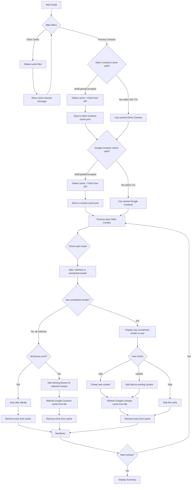

# Fix Other Contacts Sync with Caching

## Overview

Refactor the Other Contacts Sync script to use a dedicated cache for both Other Contacts and Google Contacts, with automatic filtering of emails/phones that already exist in Google Contacts.

---

## Important Constraints

- **Single Instance Only**: This script must only run one instance at a time. Running multiple instances simultaneously is not supported and may cause cache corruption or duplicate operations.
- **File-Based Cache Only**: All caching uses file-based storage (JSON files). No in-memory caching is used to ensure consistency across operations.

---

## Current State

The current `otherContactsSync.ts` implementation:
- Fetches Other Contacts from API every run (no caching)
- Fetches Google Contacts fresh every run (invalidates cache then re-fetches)
- Auto-skips entries where all emails exist in contacts (in-memory only)
- Does not add missing phones to matched contacts

---

## Proposed Architecture



---

## Key Changes

### 1. Create New Cache: `OtherContactsCache`

**File**: `src/cache/otherContactsCache.ts`

- Stores `OtherContactEntry[]` in `sources/.cache/other-contacts-cache.json`
- Same singleton pattern as `ContactCache`
- **24-hour TTL expiration** - uses existing `VALIDATION_CONSTANTS.CACHE.TTL_MS` constant
- **Corrupted cache handling** - if cache cannot be read/parsed, delete it and fetch fresh
- **Timestamp preservation** - removal operations preserve the original cache timestamp
- Methods:
  - `get()`: Returns cached entries if valid (within TTL), null if expired/missing/corrupted. Logs cache status.
  - `set(entries: OtherContactEntry[], preserveTimestamp?: number)`: Saves entries with timestamp (current or preserved)
  - `invalidate()`: Deletes cache file. Logs the action.
  - `removeByEmails(emails: string[])`: Removes entries containing any of the specified emails (preserves timestamp)
  - `removeByPhones(phones: string[])`: Removes entries containing any of the specified phones (preserves timestamp)
  - `removeByResourceName(resourceName: string)`: Removes entry by resourceName (preserves timestamp)
  - `removeEntry(entry: OtherContactEntry)`: Convenience method with error handling
  - `getWithTimestamp()`: Returns entries with original timestamp for preservation

### 2. Modify `otherContactsSync.ts`

**Cache Strategy**:
- At script start: Show menu with "Process Contacts" and "Clear Cache" options
- If cache valid: Use cached data (no API call)
- If cache expired/missing/corrupted: Delete cache file and fetch fresh from API
- After any action (add, update, skip, auto-skip): Remove the processed entry from cache
- After any Google Contacts modification: Re-read Google Contacts cache from file

**Partial Email Match Handling**:
- For each entry, check each email individually against Google Contacts
- Auto-skip emails that already exist in contacts
- Only display unmatched emails to the user
- If all emails are matched: proceed to phone check (auto-add missing phones or auto-skip)

**Auto-Skip Enhancement**:
- If all emails exist in Google Contacts BUT phones are missing → Auto-add phones to matched contact, refresh cache from file, then remove from cache
- If all emails AND all phones exist → Auto-skip silently, remove from cache

**Clear Cache Feature**:
- New menu option to clear cache files specific to this script
- Deletes `other-contacts-cache.json` only (not Google Contacts cache)
- Shows confirmation message after clearing

### 3. Add `ensureOtherContactsCached()` Method

Create a dedicated method to handle cache initialization with clear intent:

```typescript
private async ensureOtherContactsCached(): Promise<OtherContactEntry[]> {
  const cache = OtherContactsCache.getInstance();
  const cached = await cache.get();
  if (cached !== null) {
    this.uiLogger.displayInfo(`Using cached Other Contacts (${cached.length} entries)`);
    return cached;
  }
  this.uiLogger.displayInfo('Cache expired or not found, fetching fresh from API...');
  const entries = await this.fetchOtherContacts();
  const deduplicated = this.deduplicateEmails(entries);
  const filtered = deduplicated.filter(
    (entry) => entry.emails.length > 0 || entry.displayName
  );
  await cache.set(filtered);
  this.uiLogger.displayInfo(`Cached ${filtered.length} Other Contacts entries`);
  return filtered;
}
```

### 4. Add `ensureGoogleContactsCached()` Method

Create a dedicated method with proper cache population:

```typescript
private async ensureGoogleContactsCached(): Promise<ContactData[]> {
  const cache = ContactCache.getInstance();
  const cached = await cache.get();
  if (cached !== null) {
    this.uiLogger.displayInfo(`Using cached Google Contacts (${cached.length} contacts)`);
    return cached;
  }
  this.uiLogger.displayInfo('Google Contacts cache not found, fetching...');
  await this.duplicateDetector.ensureCachePopulated();
  const contacts = await cache.get() || [];
  this.uiLogger.displayInfo(`Cached ${contacts.length} Google Contacts`);
  return contacts;
}
```

### 5. Add `refreshGoogleContactsFromFile()` Method

Re-read Google Contacts cache from file after modifications:

```typescript
private async refreshGoogleContactsFromFile(): Promise<ContactData[]> {
  const cache = ContactCache.getInstance();
  const contacts = await cache.get();
  if (contacts === null) {
    await this.duplicateDetector.ensureCachePopulated();
    return await cache.get() || [];
  }
  return contacts;
}
```

### 6. Add `clearCache()` Method

Clear script-specific cache files:

```typescript
private async clearCache(): Promise<void> {
  const cache = OtherContactsCache.getInstance();
  await cache.invalidate();
  this.uiLogger.displaySuccess('Other Contacts cache cleared successfully');
}
```

### 7. Cache File Structure

**`other-contacts-cache.json`**:

```json
{
  "version": 1,
  "entries": [
    {
      "emails": ["john@example.com"],
      "phones": ["+1234567890"],
      "resourceName": "otherContacts/abc123",
      "displayName": "John Doe"
    }
  ],
  "timestamp": 1711000000000
}
```

**`contact-cache.json`** (existing, unchanged):

```json
{
  "contacts": [...],
  "timestamp": 1711000000000
}
```

---

## Files to Create

| File | Purpose |
|------|---------|
| `src/cache/otherContactsCache.ts` | New cache class for Other Contacts |

---

## Files to Modify

| File | Changes |
|------|---------|
| `src/scripts/otherContactsSync.ts` | Integrate caching, add phone auto-add logic, modify process flow, add Clear Cache menu, partial email handling |
| `src/cache/index.ts` | Export new `OtherContactsCache` |
| `src/services/contacts/duplicateDetector.ts` | Add `ensureCachePopulated()` method |

---

## Detailed Implementation Steps

### Step 1: Create OtherContactsCache

```typescript
// src/cache/otherContactsCache.ts
import { promises as fs } from 'fs';
import { join } from 'path';
import type { OtherContactEntry } from '../types/otherContactsSync';
import { EmailNormalizer } from '../services/contacts/emailNormalizer';
import { PhoneNormalizer } from '../services/contacts/phoneNormalizer';
import { VALIDATION_CONSTANTS } from '../constants';
import { SETTINGS } from '../settings';

interface OtherContactsCacheData {
  version: number;
  entries: OtherContactEntry[];
  timestamp: number;
}

const CACHE_VERSION = 1;

export class OtherContactsCache {
  private static instance: OtherContactsCache;
  private readonly TTL: number = VALIDATION_CONSTANTS.CACHE.TTL_MS;
  private readonly cacheFilePath: string;

  private constructor() {
    this.cacheFilePath = join(
      SETTINGS.linkedin.cachePath,
      'other-contacts-cache.json'
    );
  }

  static getInstance(): OtherContactsCache {
    if (!OtherContactsCache.instance) {
      OtherContactsCache.instance = new OtherContactsCache();
    }
    return OtherContactsCache.instance;
  }

  async get(): Promise<OtherContactEntry[] | null> {
    try {
      const fileContent = await fs.readFile(this.cacheFilePath, 'utf-8');
      const data: OtherContactsCacheData = JSON.parse(fileContent);
      if (data.version !== CACHE_VERSION) {
        console.info('Cache version mismatch, invalidating cache');
        await this.invalidate();
        return null;
      }
      const now = Date.now();
      const ageMs = now - data.timestamp;
      const ageHours = Math.round(ageMs / (1000 * 60 * 60) * 10) / 10;
      if (ageMs <= this.TTL) {
        console.info(`Cache hit: ${data.entries.length} entries, ${ageHours}h old`);
        return data.entries;
      }
      console.info(`Cache expired: ${ageHours}h old (TTL: 24h)`);
      await this.invalidate();
      return null;
    } catch (error) {
      if ((error as NodeJS.ErrnoException).code !== 'ENOENT') {
        console.info('Cache corrupted, invalidating');
      }
      await this.invalidate();
      return null;
    }
  }

  async getWithTimestamp(): Promise<{ entries: OtherContactEntry[]; timestamp: number } | null> {
    try {
      const fileContent = await fs.readFile(this.cacheFilePath, 'utf-8');
      const data: OtherContactsCacheData = JSON.parse(fileContent);
      return { entries: data.entries, timestamp: data.timestamp };
    } catch {
      return null;
    }
  }

  async set(entries: OtherContactEntry[], preserveTimestamp?: number): Promise<void> {
    try {
      await fs.mkdir(SETTINGS.linkedin.cachePath, { recursive: true });
      const data: OtherContactsCacheData = {
        version: CACHE_VERSION,
        entries,
        timestamp: preserveTimestamp ?? Date.now(),
      };
      await fs.writeFile(
        this.cacheFilePath,
        JSON.stringify(data, null, 2),
        'utf-8'
      );
    } catch (error: unknown) {
      console.warn(
        'Failed to write other contacts cache:',
        error instanceof Error ? error.message : 'Unknown error'
      );
    }
  }

  async invalidate(): Promise<void> {
    try {
      await fs.unlink(this.cacheFilePath);
      console.info('Other Contacts cache invalidated');
    } catch (error) {
      if ((error as NodeJS.ErrnoException).code !== 'ENOENT') {
        console.warn('Failed to invalidate cache:', (error as Error).message);
      }
    }
  }

  async removeByEmails(emails: string[]): Promise<void> {
    const cacheData = await this.getWithTimestamp();
    if (!cacheData) {
      await this.invalidate();
      return;
    }
    const normalizedEmailsToRemove = new Set(
      emails.map(e => EmailNormalizer.normalize(e))
    );
    const filtered = cacheData.entries.filter(entry => {
      for (const email of entry.emails) {
        if (normalizedEmailsToRemove.has(EmailNormalizer.normalize(email))) {
          return false;
        }
      }
      return true;
    });
    await this.set(filtered, cacheData.timestamp);
  }

  async removeByPhones(phones: string[]): Promise<void> {
    const cacheData = await this.getWithTimestamp();
    if (!cacheData) {
      await this.invalidate();
      return;
    }
    const filtered = cacheData.entries.filter(entry => {
      for (const phone of entry.phones) {
        for (const phoneToRemove of phones) {
          if (PhoneNormalizer.phonesMatch(phone, phoneToRemove)) {
            return false;
          }
        }
      }
      return true;
    });
    await this.set(filtered, cacheData.timestamp);
  }

  async removeByResourceName(resourceName: string): Promise<void> {
    const cacheData = await this.getWithTimestamp();
    if (!cacheData) {
      await this.invalidate();
      return;
    }
    const filtered = cacheData.entries.filter(entry => entry.resourceName !== resourceName);
    await this.set(filtered, cacheData.timestamp);
  }

  async removeEntry(entry: OtherContactEntry): Promise<void> {
    try {
      if (entry.emails.length > 0) {
        await this.removeByEmails(entry.emails);
      } else if (entry.phones.length > 0) {
        await this.removeByPhones(entry.phones);
      } else {
        await this.removeByResourceName(entry.resourceName);
      }
    } catch (error) {
      console.warn(`Failed to remove entry from cache: ${(error as Error).message}`);
    }
  }
}
```

### Step 2: Add ensureCachePopulated to DuplicateDetector

```typescript
// Add to src/services/contacts/duplicateDetector.ts
async ensureCachePopulated(): Promise<void> {
  const cache = ContactCache.getInstance();
  const cached = await cache.get();
  if (cached !== null) {
    return;
  }
  await this.checkDuplicateEmail('cache-population-trigger@internal');
}
```

### Step 3: Export from cache/index.ts

```typescript
export { OtherContactsCache } from './otherContactsCache';
```

### Step 4: Modify otherContactsSync.ts

Key changes in `run()`:

```typescript
async run(): Promise<void> {
  // ... auth logic ...

  try {
    const menuAction = await this.showMainMenu();
    if (menuAction === 'clear_cache') {
      await this.clearCache();
      return;
    }
    if (menuAction === 'escape') {
      return;
    }
    
    const entries = await this.ensureOtherContactsCached();
    if (entries.length === 0) {
      this.uiLogger.displayInfo('No Other Contacts found to process');
      this.displayFinalSummary();
      this.restoreConsole();
      return;
    }
    
    await this.ensureGoogleContactsCached();
    await this.processEntries(entries);
  } catch (error) {
    // ... error handling ...
  }
  // ... summary ...
}

private async showMainMenu(): Promise<string> {
  const result = await selectWithEscape<string>({
    message: 'What would you like to do?',
    loop: false,
    choices: [
      { name: '▶️  Process Other Contacts', value: 'process' },
      { name: '🗑️  Clear Cache', value: 'clear_cache' },
    ],
  });
  if (result.escaped) {
    return 'escape';
  }
  return result.value;
}

private async clearCache(): Promise<void> {
  const cache = OtherContactsCache.getInstance();
  await cache.invalidate();
  this.uiLogger.displaySuccess('Other Contacts cache cleared successfully');
}

private async ensureOtherContactsCached(): Promise<OtherContactEntry[]> {
  const cache = OtherContactsCache.getInstance();
  const cached = await cache.get();
  if (cached !== null) {
    this.uiLogger.displayInfo(`Using cached Other Contacts (${cached.length} entries)`);
    return cached;
  }
  this.uiLogger.displayInfo('Fetching Other Contacts from API...');
  const entries = await this.fetchOtherContacts();
  if (!entries || entries.length === 0) {
    return [];
  }
  const deduplicated = this.deduplicateEmails(entries);
  const filtered = deduplicated.filter(
    (entry) => entry.emails.length > 0 || entry.displayName
  );
  await cache.set(filtered);
  return filtered;
}

private async ensureGoogleContactsCached(): Promise<ContactData[]> {
  const cache = ContactCache.getInstance();
  const cached = await cache.get();
  if (cached !== null) {
    return cached;
  }
  await this.duplicateDetector.ensureCachePopulated();
  return await cache.get() || [];
}

private async refreshGoogleContactsFromFile(): Promise<ContactData[]> {
  const cache = ContactCache.getInstance();
  const contacts = await cache.get();
  if (contacts === null) {
    await this.duplicateDetector.ensureCachePopulated();
    return await cache.get() || [];
  }
  return contacts;
}
```

Key changes in `processEntries()`:

```typescript
private async processEntries(entries: OtherContactEntry[]): Promise<void> {
  const fetchSpinner = ora('Loading Google Contacts...').start();
  let allContacts = await this.ensureGoogleContactsCached();
  const contactCount = allContacts.length;
  fetchSpinner.succeed(`Google Contacts loaded (${FormatUtils.formatNumberWithLeadingZeros(contactCount)} contacts)`);
  
  const filterSpinner = ora('Filtering entries already in contacts...').start();
  
  let emailToContact = this.buildEmailToContactMap(allContacts);
  
  const autoSkipped: Array<{ entry: OtherContactEntry; contactName: string }> = [];
  const phonesAdded: Array<{ entry: OtherContactEntry; contactName: string; phonesAdded: string[] }> = [];
  const toProcess: Array<{ entry: OtherContactEntry; unmatchedEmails: string[]; matchedEmails: string[] }> = [];
  const cache = OtherContactsCache.getInstance();
  
  for (const entry of entries) {
    const { matchedEmails, unmatchedEmails, matchedContact } = this.categorizeEmails(entry, emailToContact);
    
    if (unmatchedEmails.length === 0 && entry.emails.length > 0 && matchedContact) {
      const missingPhones = entry.phones.filter(phone => {
        return !matchedContact.phones.some(existingPhone => 
          PhoneNormalizer.phonesMatch(phone, existingPhone)
        );
      });
      
      if (missingPhones.length > 0 && matchedContact.resourceName) {
        for (const phone of missingPhones) {
          await this.contactEditor.addPhoneToExistingContact(matchedContact.resourceName, phone);
        }
        allContacts = await this.refreshGoogleContactsFromFile();
        emailToContact = this.buildEmailToContactMap(allContacts);
        phonesAdded.push({
          entry,
          contactName: `${matchedContact.firstName} ${matchedContact.lastName}`.trim(),
          phonesAdded: missingPhones,
        });
        this.stats.updated++;
      } else {
        autoSkipped.push({
          entry,
          contactName: `${matchedContact.firstName} ${matchedContact.lastName}`.trim(),
        });
        this.stats.skipped++;
      }
      await cache.removeEntry(entry);
    } else if (unmatchedEmails.length > 0) {
      toProcess.push({ entry, unmatchedEmails, matchedEmails });
    } else {
      toProcess.push({ entry, unmatchedEmails: entry.emails, matchedEmails: [] });
    }
  }
  
  const totalPhonesAdded = phonesAdded.reduce((sum, p) => sum + p.phonesAdded.length, 0);
  filterSpinner.succeed(
    `Filtered: ${FormatUtils.formatNumberWithLeadingZeros(autoSkipped.length)} skipped, ` +
    `${FormatUtils.formatNumberWithLeadingZeros(totalPhonesAdded)} phones added to ${FormatUtils.formatNumberWithLeadingZeros(phonesAdded.length)} contacts, ` +
    `${FormatUtils.formatNumberWithLeadingZeros(toProcess.length)} to process`
  );
  
  if (toProcess.length === 0) {
    this.uiLogger.displaySuccess(
      `All ${entries.length} entries processed! No new entries to review.`
    );
    return;
  }
  
  const total = toProcess.length;
  for (let i = 0; i < toProcess.length; i++) {
    if (this.isCancelled) {
      break;
    }
    const { entry, unmatchedEmails, matchedEmails } = toProcess[i];
    const currentIndex = i + 1;
    this.displayEntry(entry, currentIndex, total, unmatchedEmails, matchedEmails);
    const action = await this.promptForAction();
    if (action === 'escape' || this.isCancelled) {
      break;
    }
    await this.handleAction(action, entry, unmatchedEmails);
    allContacts = await this.refreshGoogleContactsFromFile();
    emailToContact = this.buildEmailToContactMap(allContacts);
    await cache.removeEntry(entry);
  }
}

private buildEmailToContactMap(contacts: ContactData[]): Map<string, { resourceName: string; firstName: string; lastName: string; phones: string[] }> {
  const emailToContact = new Map<string, { resourceName: string; firstName: string; lastName: string; phones: string[] }>();
  for (const contact of contacts) {
    for (const emailObj of contact.emails) {
      const normalizedEmail = EmailNormalizer.normalize(emailObj.value);
      if (!emailToContact.has(normalizedEmail)) {
        emailToContact.set(normalizedEmail, {
          resourceName: contact.resourceName || '',
          firstName: contact.firstName,
          lastName: contact.lastName,
          phones: contact.phones.map(p => p.number),
        });
      }
    }
  }
  return emailToContact;
}

private categorizeEmails(
  entry: OtherContactEntry,
  emailToContact: Map<string, { resourceName: string; firstName: string; lastName: string; phones: string[] }>
): { matchedEmails: string[]; unmatchedEmails: string[]; matchedContact: { resourceName: string; firstName: string; lastName: string; phones: string[] } | null } {
  const matchedEmails: string[] = [];
  const unmatchedEmails: string[] = [];
  let matchedContact: { resourceName: string; firstName: string; lastName: string; phones: string[] } | null = null;
  
  for (const email of entry.emails) {
    const normalizedEmail = EmailNormalizer.normalize(email);
    const contact = emailToContact.get(normalizedEmail);
    if (contact) {
      matchedEmails.push(email);
      matchedContact = contact;
    } else {
      unmatchedEmails.push(email);
    }
  }
  
  return { matchedEmails, unmatchedEmails, matchedContact };
}

private displayEntry(
  entry: OtherContactEntry,
  currentIndex: number,
  total: number,
  unmatchedEmails: string[],
  matchedEmails: string[]
): void {
  console.log('');
  console.log('═'.repeat(67));
  console.log(
    `Index: ${FormatUtils.formatNumberWithLeadingZeros(currentIndex)} / ${FormatUtils.formatNumberWithLeadingZeros(total)}`
  );
  const displayName = entry.displayName
    ? this.truncateDisplayName(TextUtils.reverseHebrewText(entry.displayName))
    : '(none)';
  console.log(`Name: ${displayName}`);
  if (unmatchedEmails.length > 0) {
    const displayEmails = unmatchedEmails
      .map((e) => TextUtils.reverseHebrewText(e))
      .join(', ');
    console.log(`Emails (new): ${displayEmails}`);
  }
  if (matchedEmails.length > 0) {
    const displayMatched = matchedEmails
      .map((e) => TextUtils.reverseHebrewText(e))
      .join(', ');
    console.log(`Emails (already in contacts): ${displayMatched}`);
  }
  if (unmatchedEmails.length === 0 && matchedEmails.length === 0) {
    console.log('Emails: (none)');
  }
  if (entry.phones.length > 0) {
    const displayPhones = entry.phones
      .map((p) => TextUtils.reverseHebrewText(p))
      .join(', ');
    console.log(`Phones: ${displayPhones}`);
  } else {
    console.log('Phones: (none)');
  }
  console.log('═'.repeat(67));
  console.log('');
}
```

---

## Edge Cases

| Edge Case | Handling |
|-----------|----------|
| Empty Other Contacts | Show "No Other Contacts found" message |
| All emails already in contacts (no missing phones) | Auto-skip silently, remove from cache, show summary |
| All emails match but phones missing | Auto-add phones to matched contact, refresh cache from file, remove from cache |
| Some emails match, some don't | Auto-skip matched emails, display only unmatched emails to user |
| Script interrupted mid-process | Cache contains remaining unprocessed entries, resume on next run |
| Cache file corrupted/unreadable | Log warning, delete corrupted cache file, fetch fresh from API |
| Cache expired (>24h old) | Log expiration info, delete expired cache, fetch fresh from API |
| Cache version mismatch | Log version mismatch, invalidate cache, fetch fresh |
| Entry with no emails but has phones | Can be removed via `removeByPhones()` or `removeByResourceName()` |
| Entry with no emails and no phones | Can be removed via `removeByResourceName()` |
| User action: Add new contact | Refresh Google Contacts from file, remove entry from cache |
| User action: Update existing contact | Refresh Google Contacts from file, remove entry from cache |
| User action: Skip | Remove entry from cache |
| Cache removal fails | Log warning, continue processing (worst case: duplicate work on next run) |
| Concurrent script runs | Not supported - document as single instance only |
| User selects Clear Cache | Delete other-contacts-cache.json, show confirmation |

---

## Cache Removal Rules

**Every processed entry MUST be removed from cache**, regardless of the action taken:

| Action | Cache Removal Method |
|--------|---------------------|
| Auto-skip (all data exists) | `removeEntry()` |
| Auto-add phones | Refresh Google Contacts from file, then `removeEntry()` |
| User adds new contact | Refresh Google Contacts from file, then `removeEntry()` |
| User updates existing contact | Refresh Google Contacts from file, then `removeEntry()` |
| User skips | `removeEntry()` |

The `removeEntry()` method handles all cases with error handling:
1. If entry has emails → remove by emails
2. Else if entry has phones → remove by phones  
3. Else → remove by resourceName
4. On error → log warning, continue processing

**Important**: All removal operations preserve the original cache timestamp to ensure proper TTL behavior.

---

## Summary Display Enhancement

The final summary should include phones added count:

```typescript
private displayFinalSummary(): void {
  const totalWidth = 56;
  const title = 'Other Contacts Sync Summary';
  const line1 = `Added: ${FormatUtils.formatNumberWithLeadingZeros(this.stats.added)} | Updated: ${FormatUtils.formatNumberWithLeadingZeros(this.stats.updated)}`;
  const line2 = `Skipped: ${FormatUtils.formatNumberWithLeadingZeros(this.stats.skipped)} | Error: ${FormatUtils.formatNumberWithLeadingZeros(this.stats.error)}`;
  const line3 = `Phones auto-added: ${FormatUtils.formatNumberWithLeadingZeros(this.stats.phonesAutoAdded)}`;
  console.log('\n' + FormatUtils.padLineWithEquals(title, totalWidth));
  console.log(FormatUtils.padLineWithEquals(line1, totalWidth));
  console.log(FormatUtils.padLineWithEquals(line2, totalWidth));
  console.log(FormatUtils.padLineWithEquals(line3, totalWidth));
  console.log('='.repeat(totalWidth));
}
```

Update stats interface:

```typescript
interface OtherContactsSyncStats {
  added: number;
  updated: number;
  skipped: number;
  error: number;
  phonesAutoAdded: number;
}
```

---

## Implementation Checklist

- [ ] Create `src/cache/otherContactsCache.ts` with:
  - [ ] TTL-based `get()` method using existing `VALIDATION_CONSTANTS.CACHE.TTL_MS`
  - [ ] `set()` method with optional timestamp preservation
  - [ ] `getWithTimestamp()` method for removal operations
  - [ ] `invalidate()` method with logging
  - [ ] `removeByEmails()` method (preserves timestamp)
  - [ ] `removeByPhones()` method (preserves timestamp)
  - [ ] `removeByResourceName()` method (preserves timestamp)
  - [ ] `removeEntry()` convenience method with try/catch error handling
  - [ ] Cache version field for future-proofing
  - [ ] Logging for cache hits/misses/expiration
  - [ ] Corrupted cache handling (log and delete)
- [ ] Export `OtherContactsCache` from `src/cache/index.ts`
- [ ] Add `ensureCachePopulated()` method to `DuplicateDetector`
- [ ] Update `OtherContactsSyncStats` type to include `phonesAutoAdded`
- [ ] Modify `otherContactsSync.ts`:
  - [ ] Add `showMainMenu()` method with Process/Clear Cache options
  - [ ] Add `clearCache()` method
  - [ ] Add `ensureOtherContactsCached()` method with logging
  - [ ] Add `ensureGoogleContactsCached()` method with logging
  - [ ] Add `refreshGoogleContactsFromFile()` method
  - [ ] Add `buildEmailToContactMap()` helper method
  - [ ] Add `categorizeEmails()` method for partial match detection
  - [ ] Update `run()` to show main menu first
  - [ ] Update `displayEntry()` to show matched vs unmatched emails
  - [ ] Update `processEntries()` to:
    - [ ] Handle partial email matches (auto-skip matched, show unmatched)
    - [ ] Auto-add missing phones to matched contacts
    - [ ] Refresh Google Contacts cache from file after modifications
    - [ ] Remove every processed entry from cache (regardless of action)
  - [ ] Update `displayFinalSummary()` to show phones auto-added count
- [ ] Add documentation note about single instance requirement
- [ ] Test scenarios:
  - [ ] Fresh run (no cache) - should fetch and cache
  - [ ] Second run within 24h - should use cache
  - [ ] Run after 24h - should re-fetch
  - [ ] Corrupted cache file - should log, delete and re-fetch
  - [ ] Cache version mismatch - should invalidate and re-fetch
  - [ ] Entry with all emails matched, phones missing - should auto-add phones
  - [ ] Entry with partial email match - should show only unmatched emails
  - [ ] User skip - should remove from cache
  - [ ] Interrupted run, then resume - should continue from remaining entries
  - [ ] Clear Cache option - should delete cache and show confirmation
  - [ ] Multiple phones added - should refresh cache between each
  - [ ] Cache removal failure - should log warning and continue
