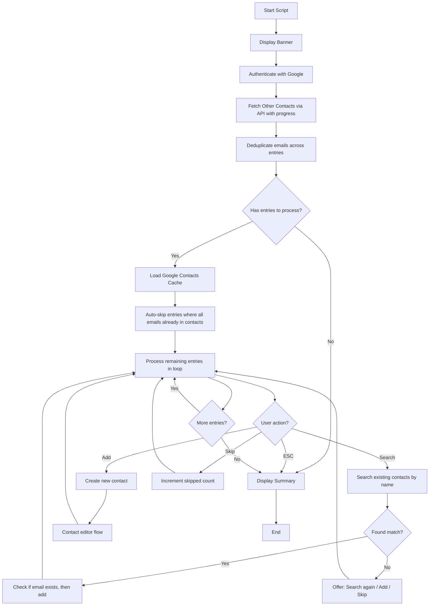

# Other Contacts Sync Script Implementation Plan

## Overview

This script fetches contacts from Google's "Other Contacts" (auto-saved contacts from email interactions) and provides an interactive CLI to review and sync them into the user's main Google Contacts.

**Menu Position**: Above "SMS & WhatsApp Sync" in the scripts menu  
**Emoji**: 🗄️ (File Cabinet)

---

## Critical Pre-requisite: OAuth Scope Update

The current application uses only `https://www.googleapis.com/auth/contacts` scope. Accessing "Other Contacts" requires an **additional scope**:

```typescript
scopes: [
  'https://www.googleapis.com/auth/contacts',
  'https://www.googleapis.com/auth/contacts.other.readonly'  // NEW
]
```

**User Impact**: After this change, users will need to re-authenticate (delete `token.json` and re-run) to grant the new permission.

**File to modify**: `src/settings/settings.ts` lines 72-73

**Important**: The script prompts for re-authentication at startup. If the user hasn't granted the new scope, they will be guided through the re-auth process before the script continues.

---

## Architecture Overview



---

## Files to Create

### 1. Main Script: `src/scripts/otherContactsSync.ts`

Structure follows `src/scripts/contactsSync.ts` pattern:

- `@injectable()` class `OtherContactsSyncScript`
- DI injection for `ContactEditor`, `DuplicateDetector`
- `SyncLogger` for file logging (`other-contacts-sync`)
- Stats tracking: `added`, `updated`, `skipped`, `error`
- Console capture/restore (no SIGINT handler - uses try/finally pattern like contactsSync.ts)
- Graceful exit via `process.exit(0)` when user cancels or presses ESC
- Main flow:
  1. Display banner
  2. Authenticate
  3. Fetch Other Contacts with progress indicator (showing fetched/total)
  4. Deduplicate emails across all entries
  5. Filter out entries with no email AND no name
  6. Auto-skip entries where all emails already in Google Contacts
  7. Interactive loop per entry (showing all emails and phones from that Other Contact)
  8. Display summary

**Key difference from SMS/WhatsApp**: No clipboard extraction - direct API fetch.

### 2. Types: `src/types/otherContactsSync.ts`

```typescript
export interface OtherContactsSyncStats {
  added: number;
  updated: number;
  skipped: number;
  error: number;
}

export interface OtherContactEntry {
  emails: string[];
  phones: string[];
  resourceName: string;
  displayName?: string;
}
```

**Note**: Other Contacts from Google can contain:
- Display name (if available)
- Email address(es)
- Phone number(s) (if available)

### 3. Service: `src/services/otherContacts/otherContactsFetcher.ts`

New service to fetch Other Contacts from Google API:

```typescript
@injectable()
export class OtherContactsFetcher {
  constructor(@inject('OAuth2Client') private auth: OAuth2Client) {}
  
  async fetchOtherContacts(
    onProgress?: (fetched: number, total: number) => void
  ): Promise<OtherContactEntry[]> {
    const service = google.people({ version: 'v1', auth: this.auth });
    const apiTracker = ApiTracker.getInstance();
    const entries: OtherContactEntry[] = [];
    let pageToken: string | undefined;
    let totalSize: number | undefined;
    do {
      const response = await retryWithBackoff(async () => {
        return await service.otherContacts.list({
          pageSize: SETTINGS.api.pageSize,
          pageToken,
          readMask: 'names,emailAddresses,phoneNumbers,metadata',
        });
      });
      await apiTracker.trackRead();
      if (totalSize === undefined && response.data.totalSize) {
        totalSize = response.data.totalSize;
      }
      const otherContacts = response.data.otherContacts || [];
      for (const person of otherContacts) {
        const emails = (person.emailAddresses || [])
          .map(e => e.value)
          .filter((v): v is string => !!v);
        const phones = (person.phoneNumbers || [])
          .map(p => p.value)
          .filter((v): v is string => !!v);
        const displayName = person.names?.[0]?.displayName;
        const resourceName = person.resourceName;
        if (resourceName) {
          entries.push({
            emails,
            phones,
            resourceName,
            displayName,
          });
        }
      }
      if (onProgress && totalSize) {
        onProgress(entries.length, totalSize);
      }
      pageToken = response.data.nextPageToken || undefined;
    } while (pageToken);
    return entries;
  }
}
```

**API Requirements**:
- `readMask` is **REQUIRED** by the API - must specify fields to return
- Valid fields for Other Contacts: `names`, `emailAddresses`, `phoneNumbers`, `metadata`, `photos`
- Use `pageToken` and `pageSize` (from `SETTINGS.api.pageSize`, max 1000) like existing contact fetching
- Use `retryWithBackoff` for API calls like other scripts
- API returns `totalSize` - use it to show progress

### 4. Service Addition: `src/services/contacts/emailNormalizer.ts`

New service for email normalization (used only for matching logic). Uses **static-only methods** to match the `PhoneNormalizer` pattern:

```typescript
export class EmailNormalizer {
  static normalize(email: string): string {
    return email.toLowerCase().trim();
  }
  
  static emailsMatch(email1: string, email2: string): boolean {
    return EmailNormalizer.normalize(email1) === EmailNormalizer.normalize(email2);
  }
}
```

**Note**: 
- Plus addressing (e.g., `user+tag@domain.com`) is NOT normalized - treated as different email.
- No DI needed - uses static methods only (matches `PhoneNormalizer` pattern).

### 5. Settings Addition: `src/settings/settings.ts`

```typescript
otherContactsSync: {
  writeDelayMs: 500,
}
```

**Shared settings used**:
- `SETTINGS.api.pageSize` - for API pagination
- `SETTINGS.contactsSync.writeDelayMs` - for write delay (or use own setting above)

---

## Files to Modify

### 1. `src/scripts/index.ts`

Add export for new script:

```typescript
import { otherContactsSyncScript } from './otherContactsSync';

export const AVAILABLE_SCRIPTS: Record<string, Script> = {
  // ... existing
  'other-contacts-sync': otherContactsSyncScript,
};
```

### 2. `src/index.ts`

Update `scriptOrder` to place above SMS/WhatsApp:

```typescript
const scriptOrder = [
  'contacts-sync',
  'events-jobs-sync',
  'linkedin-sync',
  'other-contacts-sync',  // NEW - above sms-whatsapp-sync
  'sms-whatsapp-sync',
  'statistics',
];
```

### 3. `src/settings/settings.ts`

1. Add new OAuth scope
2. Add `otherContactsSync` settings section

### 4. `src/di/container.ts`

Register new services:
- `OtherContactsFetcher`
- `OtherContactsSyncScript`

**Note**: `EmailNormalizer` uses static methods only, no DI registration needed.

```typescript
import { OtherContactsFetcher } from '../services/otherContacts/otherContactsFetcher';
import { OtherContactsSyncScript } from '../scripts/otherContactsSync';

container.bind(OtherContactsFetcher).toSelf();
container.bind(OtherContactsSyncScript).toSelf();
```

### 5. `src/services/contacts/contactEditor.ts`

#### 5a. Extend `collectInitialInput` to accept optional pre-populated data

The current `collectInitialInput()` method takes no parameters. Extend it to optionally accept pre-populated data (similar to how `EventsContactEditor` works):

```typescript
async collectInitialInput(prePopulatedData?: Partial<EditableContactData>): Promise<EditableContactData> {
  // If prePopulatedData provided, use values as defaults
  const defaultCompany = prePopulatedData?.company || '';
  const defaultFirstName = prePopulatedData?.firstName || '';
  const defaultLastName = prePopulatedData?.lastName || '';
  const defaultEmails = prePopulatedData?.emails || [];
  const defaultPhones = prePopulatedData?.phones || [];
  const defaultLabelResourceNames = prePopulatedData?.labelResourceNames || [];
  // ... rest of implementation uses these defaults
}
```

This allows the Other Contacts Sync script to pre-populate:
- `firstName` and `lastName` parsed from `displayName`
- `emails` from the Other Contact entry
- `phones` from the Other Contact entry

#### 5b. Add phone-exists check to existing `addPhoneToExistingContact`

Update the existing method to check if phone already exists before adding (for consistency with new email method):

```typescript
async addPhoneToExistingContact(resourceName: string, phone: string): Promise<void> {
  const service = google.people({ version: 'v1', auth: this.auth });
  const apiTracker = ApiTracker.getInstance();
  const currentContact = await retryWithBackoff(async () => {
    return await service.people.get({
      resourceName,
      personFields: 'phoneNumbers,etag',
    });
  });
  await apiTracker.trackRead();
  const existingPhones = currentContact.data.phoneNumbers || [];
  // NEW: Check if phone already exists
  const phoneAlreadyExists = existingPhones.some(p => 
    PhoneNormalizer.phonesMatch(p.value || '', phone)
  );
  if (phoneAlreadyExists) {
    this.uiLogger.displayWarning(`Phone ${phone} already exists in this contact`);
    return;
  }
  // ... rest of existing implementation
}
```

#### 5c. Add new method for adding email to existing contact:

```typescript
async addEmailToExistingContact(resourceName: string, email: string): Promise<void> {
  const service = google.people({ version: 'v1', auth: this.auth });
  const apiTracker = ApiTracker.getInstance();
  const currentContact = await retryWithBackoff(async () => {
    return await service.people.get({
      resourceName,
      personFields: 'emailAddresses,etag',
    });
  });
  await apiTracker.trackRead();
  const existingEmails = currentContact.data.emailAddresses || [];
  const emailAlreadyExists = existingEmails.some(e => 
    EmailNormalizer.emailsMatch(e.value || '', email)
  );
  if (emailAlreadyExists) {
    this.uiLogger.displayWarning(`Email ${email} already exists in this contact`);
    return;
  }
  const updatedEmails = [
    ...existingEmails,
    { value: email, type: 'other' }
  ];
  try {
    await retryWithBackoff(async () => {
      return await service.people.updateContact({
        resourceName,
        updatePersonFields: 'emailAddresses',
        requestBody: {
          etag: currentContact.data.etag,
          emailAddresses: updatedEmails,
        },
      });
    });
  } catch (error: unknown) {
    const errorCode = (error as { code?: number; status?: number })?.code || (error as { code?: number; status?: number })?.status;
    if (errorCode === 412) {
      const refreshedContact = await retryWithBackoff(async () => {
        return await service.people.get({
          resourceName,
          personFields: 'emailAddresses,etag',
        });
      });
      await apiTracker.trackRead();
      const refreshedEmails = refreshedContact.data.emailAddresses || [];
      const emailExistsAfterRefresh = refreshedEmails.some(e => 
        EmailNormalizer.emailsMatch(e.value || '', email)
      );
      if (emailExistsAfterRefresh) {
        this.uiLogger.displayWarning(`Email ${email} already exists in this contact`);
        return;
      }
      const retryUpdatedEmails = [
        ...refreshedEmails,
        { value: email, type: 'other' }
      ];
      await retryWithBackoff(async () => {
        return await service.people.updateContact({
          resourceName,
          updatePersonFields: 'emailAddresses',
          requestBody: {
            etag: refreshedContact.data.etag,
            emailAddresses: retryUpdatedEmails,
          },
        });
      });
    } else {
      throw error;
    }
  }
  await apiTracker.trackWrite();
  await this.delay(SETTINGS.contactsSync.writeDelayMs);
  await ContactCache.getInstance().invalidate();
}
```

### 6. `src/cache/contactCache.ts`

Add method for email lookup (uses `EmailNormalizer` for matching):

```typescript
async getByNormalizedEmail(email: string): Promise<ContactData[]> {
  const contacts = await this.get();
  if (!contacts) return [];
  const normalizedEmail = EmailNormalizer.normalize(email);
  const matches: ContactData[] = [];
  for (const contact of contacts) {
    for (const contactEmail of contact.emails) {
      if (EmailNormalizer.normalize(contactEmail.value) === normalizedEmail) {
        matches.push(contact);
        break;
      }
    }
  }
  return matches;
}
```

---

## CLI Display Format

### Per-entry display (showing all emails and phones from same Other Contact):

```
═════════════════════════════════════════════════════════════════════
Index: 000,001 / 000,004
Name: John Doe
Emails: john@work.com, john@home.com
Phones: +1-234-567-8900
═════════════════════════════════════════════════════════════════════
? What would you like to do? 
❯ 🔍 Search in contacts
  ➕ Add a new contact
  ⏭️  Skip this entry
```

Or without name:

```
═════════════════════════════════════════════════════════════════════
Index: 000,002 / 000,004
Name: (none)
Emails: unknown@test.com
Phones: (none)
═════════════════════════════════════════════════════════════════════
? What would you like to do? 
❯ 🔍 Search in contacts
  ➕ Add a new contact
  ⏭️  Skip this entry
```

Or with only name (no email):

```
═════════════════════════════════════════════════════════════════════
Index: 000,003 / 000,004
Name: Jane Smith
Emails: (none)
Phones: +972-52-123-4567
═════════════════════════════════════════════════════════════════════
? What would you like to do? 
❯ 🔍 Search in contacts
  ➕ Add a new contact
  ⏭️  Skip this entry
```

### Progress indicator during fetch:

```
⠋ Fetching Other Contacts... (250 / 1,234)
⠋ Fetching Other Contacts... (500 / 1,234)
✓ Fetched 1,234 Other Contacts
```

### Summary display (aligned with totalWidth = 56 like Contacts Sync):

```
=======Other Contacts Sync Summary=======
===Added: 000,000 | Updated: 000,000===
==Skipped: 000,000 | Error: 000,000==
========================================
```

Using `totalWidth = 56` to match `ContactDisplay.displaySummary()` pattern used by Contacts Sync. Alternatively, can reuse `ContactDisplay.displaySummary()` directly.

---

## Behavior Decisions

| Scenario | Behavior |
|----------|----------|
| Email already in Google Contacts | Auto-skip with success message |
| Other Contact has multiple emails | Display ALL emails together as single entry |
| Other Contact has phone numbers | Display phones alongside emails |
| Other Contact has no email but has name | Include - show name, allow user to search/add/skip |
| Other Contact has no email AND no name | Filter out - not processable |
| Contact creation | Manual creation (not copy API) - gives user control to edit |
| Same email appears in different Other Contact entries | Auto-skip the second occurrence (already processed or exists in contacts) |
| Email already exists in target contact | Warn user and skip adding |

---

## Email Deduplication

Before processing, deduplicate emails across all Other Contact entries:

```typescript
private deduplicateEmails(entries: OtherContactEntry[]): OtherContactEntry[] {
  const seenEmails = new Set<string>();
  return entries.map(entry => {
    const uniqueEmails = entry.emails.filter(email => {
      const normalized = EmailNormalizer.normalize(email);
      if (seenEmails.has(normalized)) {
        return false;
      }
      seenEmails.add(normalized);
      return true;
    });
    return { ...entry, emails: uniqueEmails };
  }).filter(entry => entry.emails.length > 0 || entry.displayName);
}
```

This ensures:
1. Each email is only processed once across all entries
2. Duplicate emails within the same entry are removed
3. Entries left with no emails but still having a name are kept

---

## Edge Cases to Handle

1. **Empty Other Contacts list**: Display friendly message, show summary with all zeros
2. **API errors during fetch**: Log error, show what was fetched before error
3. **Duplicate emails within Other Contacts**: Deduplicate before processing
4. **Duplicate emails within a single entry**: Deduplicate within each entry
5. **User presses ESC mid-process**: Break loop, show summary of what was done
6. **Rate limiting (429 errors)**: Use existing `retryWithBackoff` wrapper
7. **Re-authentication required**: Script prompts at startup; guide user to delete token.json and re-run
8. **Entry with only name (no email)**: Display and allow user action - useful for searching existing contacts
9. **Entry with no email AND no name**: Filter out entirely - nothing useful to process
10. **Email already added to a different contact**: Auto-skip (email already exists in contacts)
11. **Email already exists in target contact**: Warn user and skip adding the email
12. **Very long display names (100+ chars)**: Truncate for display with ellipsis
13. **Large number of Other Contacts (10K+)**: Show progress indicator during fetch with totalSize
14. **Empty string display name**: Treat as no name (`displayName?.trim() || undefined`)
15. **Malformed API response**: Handle missing fields gracefully with defaults

---

## Logging Strategy

Use `SyncLogger` for comprehensive logging:

```typescript
private readonly logger: SyncLogger;

constructor() {
  this.logger = new SyncLogger('other-contacts-sync');
}

async run(): Promise<void> {
  await this.logger.initialize();
  // ...
}
```

**Log File Location**: `logs/other-contacts-sync_DD_MM_YYYY.log`

**What to Log:**
- Script start/end with summary stats
- Fetch results (total count, filtered count)
- Each entry processing action (search, add, update, skip)
- API calls (tracked via ApiTracker)
- Errors with full context
- User interactions (ESC, menu selections)

**Log Levels:**
- `logMain()` - Normal operations, user actions
- `logError()` - Errors and exceptions

---

## API Tracking

Use `ApiTracker` for monitoring API usage:

```typescript
const apiTracker = ApiTracker.getInstance();
await apiTracker.trackRead();  // After each otherContacts.list page
await apiTracker.trackRead();  // After each contact fetch for update
await apiTracker.trackWrite(); // After each contact create/update
```

---

## Display Name Parsing

When creating a new contact from an Other Contact entry, parse the display name:

```typescript
// Use existing TextUtils.parseFullName() for consistency
const { firstName, lastName } = TextUtils.parseFullName(displayName || '');
```

**Note**: `TextUtils.parseFullName()` must handle empty strings gracefully, returning `{ firstName: '', lastName: '' }`.

When adding email to existing contact, the display name from Other Contact is shown for context but not used to modify the existing contact's name.

---

## Search Flow

When user selects "Search in contacts":

1. Prompt for name to search (default: display name from Other Contact if available)
2. Use `DuplicateDetector.checkDuplicateName()` for fuzzy name matching
3. Display matches and allow selection or further action

```typescript
// Search by name
const nameResult = await inputWithEscape({
  message: 'Enter name to search:',
  default: entry.displayName || '',
});

// Use existing duplicate detection
const nameParts = searchName.split(' ');
const firstName = nameParts[0] || '';
const lastName = nameParts.slice(1).join(' ') || '';
const matches = await this.duplicateDetector.checkDuplicateName(firstName, lastName);
```

---

## Google People API Reference

### Fetching Other Contacts

```
GET /v1/otherContacts?readMask=names,emailAddresses,phoneNumbers,metadata HTTP/1.1
Host: people.googleapis.com
```

**IMPORTANT**: The `readMask` parameter is **REQUIRED** by the API. Valid fields for Other Contacts with `READ_SOURCE_TYPE_CONTACT`:
- `names`
- `emailAddresses`
- `phoneNumbers`
- `metadata`
- `photos`

**API Documentation**: https://developers.google.com/people/v1/other-contacts

### Response Structure

```typescript
{
  otherContacts: Person[],
  nextPageToken?: string,
  nextSyncToken?: string,
  totalSize: number  // Total count without pagination - use for progress
}
```

### Available Methods

- `otherContacts.list` - List all "Other contacts" with pagination
- `otherContacts.copyOtherContactToMyContactsGroup` - Copy contact directly (not used - we create manually for more control)
- `otherContacts.search` - Search Other contacts (for future enhancement)

### Required OAuth Scope

- `https://www.googleapis.com/auth/contacts.other.readonly`

---

## Testing Considerations

### Unit Tests

- [ ] Unit tests for `OtherContactsFetcher` with mocked Google API responses
- [ ] Unit tests for `OtherContactsFetcher` with empty response
- [ ] Unit tests for `OtherContactsFetcher` with malformed/partial response data
- [ ] Unit tests for `OtherContactsFetcher` progress callback invocation
- [ ] Unit tests for `OtherContactsFetcher` network failure mid-pagination recovery
- [ ] Unit tests for `EmailNormalizer` normalization and matching
- [ ] Unit tests for email extraction and grouping logic
- [ ] Unit tests for email deduplication across entries
- [ ] Unit tests for email deduplication within single entry
- [ ] Unit tests for `addEmailToExistingContact` method
- [ ] Unit tests for `addEmailToExistingContact` when email already exists (warning)
- [ ] Unit tests for `addEmailToExistingContact` etag conflict (412) handling
- [ ] Unit tests for `addEmailToExistingContact` etag conflict when email exists after refresh
- [ ] Unit tests for `addPhoneToExistingContact` when phone already exists (warning) - NEW
- [ ] Unit tests for `ContactCache.getByNormalizedEmail()` lookup
- [ ] Unit tests for display name parsing with `TextUtils.parseFullName()` including empty string
- [ ] Unit tests for filtering entries with no email AND no name
- [ ] Unit tests for re-authentication flow detection
- [ ] Unit tests for very long display name truncation (100+ chars)
- [ ] Unit tests for user cancellation during email-add operation
- [ ] Unit tests for rate limit (429) handling specifically for `otherContacts.list`
- [ ] Unit tests for scope insufficient error (403) handling
- [ ] Unit tests for `collectInitialInput` with pre-populated data

### Integration Test Scenarios

- [ ] Empty Other Contacts response from API
- [ ] Other Contacts with/without emails
- [ ] Other Contacts with phone numbers (displayed in UI)
- [ ] Other Contacts with multiple emails (displayed together)
- [ ] Other Contacts with only name (no email)
- [ ] Auto-skip behavior when email exists in Google Contacts
- [ ] Auto-skip when same email appears in multiple Other Contact entries
- [ ] Warning when email already exists in target contact
- [ ] Warning when phone already exists in target contact (updated method)
- [ ] Search flow with `DuplicateDetector`
- [ ] Progress indicator during fetch shows correct counts
- [ ] SyncLogger integration
- [ ] ApiTracker integration
- [ ] Network failure mid-pagination - partial results handling
- [ ] Graceful exit via ESC key (try/finally pattern)
- [ ] Pre-populated contact creation flow with emails and phones from Other Contact

---

## Potential Risks and Mitigations

| Risk | Mitigation |
|------|------------|
| OAuth scope change breaks existing users | Document in README, provide clear re-auth instructions; script prompts at startup |
| Large number of Other Contacts (10K+) | Pagination handled; progress indicator shows fetched/total during fetch |
| API quota exhaustion | Use existing `retryWithBackoff` patterns, track via ApiTracker |
| Other Contacts API returns limited data | Accept limitation; user can enrich during creation |
| `readMask` parameter missing | Code explicitly includes required `readMask` parameter |

---

## Implementation Checklist

### Pre-requisites
- [ ] Add `contacts.other.readonly` scope to `settings.ts`
- [ ] Add phone-exists check to existing `addPhoneToExistingContact` method in `ContactEditor` (for consistency with new `addEmailToExistingContact`)

### Core Implementation
- [ ] Create `src/types/otherContactsSync.ts` with stats and entry interfaces (including phones)
- [ ] Create `src/services/contacts/emailNormalizer.ts` for email matching
- [ ] Create `src/services/otherContacts/otherContactsFetcher.ts` to fetch and paginate Other Contacts with progress
- [ ] Add `addEmailToExistingContact` method to `ContactEditor` with email-exists check
- [ ] Add `getByNormalizedEmail` method to `ContactCache`
- [ ] Create `src/scripts/otherContactsSync.ts` following `smsWhatsappSync.ts` patterns
- [ ] Implement email deduplication logic (across entries and within entries)
- [ ] Implement progress indicator during fetch using `totalSize`
- [ ] Integrate `SyncLogger` for file logging
- [ ] Integrate `ApiTracker` for API usage tracking
- [ ] Register `OtherContactsFetcher` and `OtherContactsSyncScript` in `container.ts` (EmailNormalizer uses static methods, no DI needed)
- [ ] Add `otherContactsSyncScript` to `AVAILABLE_SCRIPTS` in `scripts/index.ts`
- [ ] Add `other-contacts-sync` to `scriptOrder` in `index.ts` above `sms-whatsapp-sync`
- [ ] Add `otherContactsSync` settings section to `settings.ts`
- [ ] Use `totalWidth = 56` for summary display (matching Contacts Sync / `ContactDisplay.displaySummary()`)
- [ ] Extend `collectInitialInput` in `ContactEditor` to accept optional pre-populated data
- [ ] Create unit tests for `OtherContactsFetcher` with mocked API responses
- [ ] Create unit tests for `OtherContactsFetcher` empty response handling
- [ ] Create unit tests for `OtherContactsFetcher` malformed response handling
- [ ] Create unit tests for `EmailNormalizer`
- [ ] Create unit tests for `addEmailToExistingContact` including email-exists warning
- [ ] Create unit tests for email deduplication
- [ ] Create unit tests for re-auth flow detection
- [ ] Run linter and build to verify no issues
- [ ] Test full flow manually
