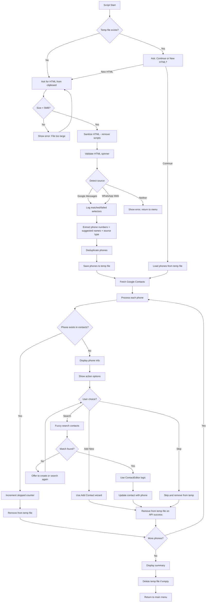

# SMS & WhatsApp Sync Implementation Plan

## Overview

Build a new CLI script that extracts phone numbers from Google Messages/WhatsApp Web HTML clipboard content, matches them against Google Contacts using fuzzy name search, and allows users to add/update contact information.

**Key Goal**: Detect phone numbers that are NOT synced with Google Contacts. If a conversation shows only a name (no phone number visible), it means the contact is already synced and should be ignored.

**Scope Limitation**: This script only processes what is provided via clipboard. It does not scroll, navigate, or interact with the browser. Users must manually scroll through all conversations before copying the HTML.

**Single User Mode**: This script is for personal use only. Concurrent execution is not supported - do not run multiple instances simultaneously.

**Interactive Processing**: This script is NOT automatic. After extraction, each phone number is presented to the user one-by-one for manual decision (similar to the "Sync Contacts" script). The user decides for each phone whether to search, add, or skip.

## Architecture Overview



**Important Flow Notes:**
- **Interactive Processing**: The `ProcessLoop` is NOT automatic. Each phone is presented to the user who must manually choose an action.
- **Ctrl+C during extraction**: If user interrupts during the extraction phase (before temp file is complete), delete temp file and exit.
- **ESC during processing**: If user presses ESC while processing phones, exit gracefully - current phone remains in temp file for next session.
- **SIGINT/Ctrl+C during processing**: Behaves consistently with ESC - exit gracefully, current phone remains in temp file for next session.

**SIGINT Handler Implementation:**
```typescript
import { unlinkSync } from 'fs';

let extractionPhaseComplete = false;

// Register SIGINT handler at script start
// IMPORTANT: Use synchronous fs.unlinkSync because async handlers may not complete before exit
process.on('SIGINT', () => {
  if (!extractionPhaseComplete) {
    // During extraction phase - delete incomplete temp file
    try {
      unlinkSync(SETTINGS.smsWhatsappSync.tempFilePath);
    } catch {}
    console.log('\n⚠️  Extraction interrupted. Temp file deleted.');
  } else {
    // During processing phase - keep current phone in temp file
    console.log('\n⚠️  Processing interrupted. Progress saved to temp file.');
  }
  process.exit(0);
});

// After extraction and temp file save completes:
extractionPhaseComplete = true;
```

## Script Details

- **Menu Position**: After LinkedIn Sync
- **Emoji**: 💬 (Speech Bubble)
- **Script Key**: `sms-whatsapp-sync`

## Files to Create

### 1. New Script: `src/scripts/smsWhatsappSync.ts`

Main script class `SmsWhatsappSyncScript` with DI integration.

**Responsibilities:**
- Check for existing temp file and prompt to continue or start fresh (selecting "New HTML" **overwrites** the existing temp file)
- Read HTML from clipboard with size validation (max 5MB)
- Sanitize HTML (remove `<script>` tags)
- Orchestrate validation, extraction, and processing flow
- Display progress and summary
- Handle ESC gracefully during phone processing (keep current phone in temp file)
- Handle Ctrl+C/SIGINT during extraction phase (delete temp file and exit - incomplete extraction should not be resumed)
- Handle Ctrl+C/SIGINT during processing phase (behave like ESC - keep current phone in temp file for next session)
- Remove phones from temp file ONLY after successful API request or user skip
- Deduplicate phones during extraction (unique phone numbers only)
- Process each phone interactively - present to user one-by-one for manual decision (not automatic)

**Reuses:**
- `ContactEditor` - for contact creation/update wizard (extended with `addPhoneToExistingContact`)
- `DuplicateDetector` - for fuzzy name matching and phone duplicate detection
- `ContactCache` - for Google Contacts caching (extended with `getByNormalizedPhone`)

### 2. New Service: `src/services/messaging/htmlSourceDetector.ts`

Injectable service for detecting HTML source with logging.

```typescript
import { injectable } from 'inversify';

export interface DetectionResult {
  source: 'google-messages' | 'whatsapp-web' | null;
  matchedSelectors: string[];
  failedSelectors: string[];
  confidence: number; // 0-100%
}

@injectable()
export class HtmlSourceDetector {
  detectSource(html: string): DetectionResult;
}
```

**Google Messages Detection Elements (5 of 10 required):**
Detection uses stable selectors that are less likely to change:
1. `messages.google.com` in URLs (stable - domain)
2. `MW_CONFIG` window variable in script (stable - config)
3. `mws-conversation-list-item` component (stable - semantic)
4. `mws-conversation-snippet` component (stable - semantic)
5. `mws-relative-timestamp` component (stable - semantic)
6. `data-e2e-` attribute prefix (stable - test attributes)
7. `_ngcontent-ng-c` Angular attributes (semi-stable)
8. `mws-icon` component (stable - semantic)
9. `android-messages-web` in URLs (stable - domain path)
10. `Google Messages for web` in title (stable - title)

**WhatsApp Web Detection Elements (5 of 10 required):**
Detection uses stable selectors that are less likely to change:
1. `<html id="whatsapp-web"` (stable - root element)
2. `static.whatsapp.net` in URLs (stable - CDN domain)
3. `web.whatsapp.com` in URLs (stable - domain)
4. `/data/manifest.json` link (stable - PWA manifest)
5. `app-wrapper-web` class (semi-stable)
6. `data-icon="` attribute pattern (semi-stable)
7. `WhatsApp Web` in meta description (stable)
8. `data-btmanifest` attribute (semi-stable)
9. `requireLazy` script pattern (semi-stable - FB infra)
10. `wa-popovers-bucket` element id (semi-stable)

**Confidence Logging**: Log detection confidence percentage and warn if < 70%.

### 3. New Service: `src/services/messaging/phoneExtractor.ts`

Injectable service for extracting and validating phone numbers from HTML using JSDOM for reliable DOM parsing.

**Architecture: Strategy Pattern**
Use Strategy Pattern to make platform-specific extraction extensible:

```typescript
import { injectable } from 'inversify';
import { JSDOM } from 'jsdom';

export interface ExtractedContact {
  phone: string;
  normalizedPhone: string;
  suggestedName?: string;  // Includes emojis and non-ASCII characters if present
}

// Strategy interface for platform-specific extraction
export interface MessagePlatformExtractor {
  extractPhones(html: string): ExtractedContact[];
}

// Google Messages specific extractor
@injectable()
export class GoogleMessagesExtractor implements MessagePlatformExtractor {
  extractPhones(html: string): ExtractedContact[] {
    // Uses data-e2e-conversation-name pattern
  }
}

// WhatsApp Web specific extractor with fallback strategies
@injectable()
export class WhatsAppWebExtractor implements MessagePlatformExtractor {
  extractPhones(html: string): ExtractedContact[] {
    // Uses span[dir="auto"] as primary, _ao3e as fallback
  }
}

// Main extractor that delegates to platform-specific strategies
@injectable()
export class PhoneExtractor {
  private strategies: Map<string, MessagePlatformExtractor> = new Map();
  
  constructor(
    @inject(GoogleMessagesExtractor) googleExtractor: GoogleMessagesExtractor,
    @inject(WhatsAppWebExtractor) whatsappExtractor: WhatsAppWebExtractor
  ) {
    this.strategies.set('google-messages', googleExtractor);
    this.strategies.set('whatsapp-web', whatsappExtractor);
  }
  
  extractPhoneNumbers(html: string, source: 'google-messages' | 'whatsapp-web'): ExtractedContact[] {
    const strategy = this.strategies.get(source);
    if (!strategy) {
      throw new Error(`No extraction strategy for source: ${source}`);
    }
    return strategy.extractPhones(html);
  }
}
```

This pattern makes it easy to add support for other platforms (Telegram, Signal, etc.) in the future.

**HTML Parsing:**
Use JSDOM for reliable DOM parsing instead of regex-based extraction:
```typescript
import { JSDOM } from 'jsdom';

private parseHtml(html: string): Document {
  const dom = new JSDOM(html);
  return dom.window.document;
}
```

**Extraction Strategy:**

**IMPORTANT: International Phone Number Support**
This script extracts phone numbers from ANY country, regardless of country code. The extraction patterns must support all international formats including but not limited to:
- US/Canada: `+1 (555) 123-4567`, `555-123-4567`, `1-800-FLOWERS`
- UK: `+44 20 7946 0958`, `020 7946 0958`
- European: `+49 30 1234567`, `+33 1 23 45 67 89`
- Israeli: `+972 52-123-4567`, `052-123-4567`
- Asian: `+81 3-1234-5678`, `+86 10 1234 5678`
- Australian: `+61 2 1234 5678`
- And all other international formats

**For Google Messages:**
Google Messages shows either a name OR a phone number for each conversation - never both together.
- If it shows a **name**: the contact is already synced in Google Contacts → **skip extraction**
- If it shows a **phone number**: the contact is NOT synced → **extract the phone**

Primary extraction using simple string search:
```typescript
// Primary: Search for 'data-e2e-conversation-name="">' pattern and extract content between > and <
// Pattern in HTML: data-e2e-conversation-name="">052-999-5784</span>
const pattern = /data-e2e-conversation-name="">([^<]+)</g;
let match;
while ((match = pattern.exec(html)) !== null) {
  const text = match[1].trim();
  if (text && this.isLikelyPhoneNumber(text)) {
    // Extract phone - e.g., "052-999-5784", "052-999-5776", "12242063830"
  }
}
```

**Important**: For Google Messages, do NOT extract suggested names - only extract phone numbers.

**For WhatsApp Web:**
WhatsApp Web can show phone numbers with optional associated names. The extraction focuses on **conversation titles only** (not message content).

**Extraction Target**: This script extracts phone numbers from conversation titles in the chat list sidebar. It does NOT parse message content or body text.

Primary extraction using JSDOM with prioritized strategies:
```typescript
// Strategy 1 (Primary): Extract from span[dir="auto"] elements
// This is the most stable selector - WhatsApp uses dir="auto" for all text content
const spans = doc.querySelectorAll('span[dir="auto"]');
for (const span of spans) {
  const text = span.textContent?.trim();
  if (text && this.isLikelyPhoneNumber(text)) {
    // Extract phone - e.g., "+972 55-987-4713"
    // Also check for aria-label for suggested name (e.g., aria-label="Maybe נתנאל")
    const ariaLabel = span.getAttribute('aria-label');
    const suggestedName = ariaLabel ? this.extractNameFromAriaLabel(ariaLabel) : undefined;
  }
}

// Strategy 2 (Fallback): Extract from elements with class containing _ao3e
// Note: Class names like _ao3e are minified and may change between deployments
const ao3eSpans = doc.querySelectorAll('span._ao3e, [class*="_ao3e"]');
for (const span of ao3eSpans) {
  const text = span.textContent?.trim();
  if (text && this.isLikelyPhoneNumber(text)) {
    // Extract phone from _ao3e class elements
  }
}

// Strategy 3 (Fallback): Extract from title attributes
const titledElements = doc.querySelectorAll('[title]');
for (const el of titledElements) {
  const title = el.getAttribute('title');
  if (title && this.isLikelyPhoneNumber(title)) {
    // Extract phone from title attribute
  }
}

// Strategy 4 (Last resort): Generic phone pattern search in text nodes
// Only used if strategies 1-3 yield no results
```

**Suggested Name Extraction:**
WhatsApp shows suggested names in two ways:
1. `aria-label` attribute: `aria-label="Maybe נתנאל"` → extract "נתנאל"
2. Text with `~` prefix: `~ נתנאל` → extract "נתנאל"

Display both values as suggested names when available:
```typescript
private extractNameFromAriaLabel(ariaLabel: string): string | undefined {
  // Pattern: "Maybe <name>" or similar
  const match = ariaLabel.match(/^Maybe\s+(.+)$/i);
  return match ? match[1].trim() : undefined;
}

private extractNameFromTildePrefix(text: string): string | undefined {
  // Pattern: "~ <name>"
  const match = text.match(/^~\s*(.+)$/);
  return match ? match[1].trim() : undefined;
}
```

This pattern works for both:
- **Conversation list view** (`whatsapp-web.html`) - extracts phones from chat list sidebar
- **Group info view** (`whatsapp-web-group.html`) - extracts phones from group participants list

Both views use the same DOM pattern for displaying phone numbers:
```html
<span dir="auto" class="x1rg5ohu _ao3e">+972 54-441-9002</span>:&nbsp;
```

**Fallback strategies (in order of priority):**
1. `span[dir="auto"]` - most stable, WhatsApp uses this for all text content (primary)
2. Elements with class containing `_ao3e` - less stable, may change between deployments (fallback)
3. `[title]` attributes matching phone patterns (fallback)
4. Generic phone pattern search in text nodes (last resort)

**IMPORTANT: Universal Phone Pattern Recognition**
A value is classified as a phone number if it matches the universal international phone regex:

```typescript
// Universal phone pattern that supports ALL international formats
// Requires the pattern to have phone-like structure, not just digits
static readonly PHONE_UNIVERSAL = /^[+]?[(]?[0-9]{1,4}[)]?[-\s./0-9]*$/;

// Validation: Must have at least 7 digits and no more than 15 (E.164 max)
private isLikelyPhoneNumber(value: string): boolean {
  // Remove all non-digit characters for digit count
  const digitsOnly = value.replace(/\D/g, '');
  if (digitsOnly.length < 7 || digitsOnly.length > 15) return false;
  // Must not be a date pattern (various formats)
  if (/^\d{1,2}\/\d{1,2}\/\d{2,4}$/.test(value)) return false;  // MM/DD/YYYY
  if (/^\d{1,2}-\d{1,2}-\d{2,4}$/.test(value)) return false;    // MM-DD-YYYY
  if (/^\d{4}-\d{1,2}-\d{1,2}$/.test(value)) return false;      // YYYY-MM-DD
  // Must not be a CSS value
  if (/^\d+px$/.test(value)) return false;
  if (/^\d+%$/.test(value)) return false;
  if (/^\d+em$/.test(value)) return false;
  if (/^\d+rem$/.test(value)) return false;
  if (/^\d+vh$/.test(value)) return false;
  if (/^\d+vw$/.test(value)) return false;
  // Must not be a time pattern
  if (/^\d+\s*(AM|PM)$/i.test(value)) return false;
  if (/^\d{1,2}:\d{2}(:\d{2})?$/.test(value)) return false;     // HH:MM or HH:MM:SS
  // Must not be a year only
  if (/^(19|20)\d{2}$/.test(value)) return false;
  // Must not be a simple number without phone structure (no separators or +)
  if (/^\d+$/.test(value) && digitsOnly.length < 10) return false;
  // Check against universal phone pattern
  return PHONE_PATTERNS.PHONE_UNIVERSAL.test(value);
}
```

**Name Extraction:**
- **Google Messages**: No name extraction (only phone or name is shown, never both)
- **WhatsApp Web**: For entries showing both phone and name in proximity, extract the associated name
- **Name preservation**: Names are extracted as-is, including emojis, non-ASCII characters, and special symbols. No stripping or sanitization of name content.

**Hebrew Name Detection:**
Use existing `RegexPatterns.HEBREW` (`/[\u0590-\u05FF]/`) to detect Hebrew text and apply `TextUtils.reverseHebrewText()` for proper display.

**Deduplication:**
During extraction, maintain a Set of normalized phone numbers. Only add unique phones to results.

**Post-Extraction Validation:**
After extraction, validate each phone number to filter out false positives:
```typescript
private validateExtractedPhone(phone: string): boolean {
  const digitsOnly = phone.replace(/\D/g, '');
  // Must have 7-15 digits (E.164 standard)
  if (digitsOnly.length < 7 || digitsOnly.length > 15) return false;
  // Must not be all zeros or repeated digits
  if (/^0+$/.test(digitsOnly) || /^(.)\1+$/.test(digitsOnly)) return false;
  return true;
}
```

### 4. New Service: `src/services/messaging/htmlSanitizer.ts`

Injectable service for sanitizing HTML content before processing.

```typescript
import { injectable } from 'inversify';

@injectable()
export class HtmlSanitizer {
  sanitize(html: string): string;
}
```

**Features:**
- Remove all `<script>` tags and their content
- Remove all `<style>` tags and their content
- Validate HTML size (max 5MB - reference files are ~1MB each, allowing room for users with many conversations)

### 5. New Service: `src/services/contacts/phoneNormalizer.ts`

Injectable unified phone normalization service for consistent comparison across the codebase.

**IMPORTANT**: Phone numbers can include `+`, `#`, `*` symbols and any country code. The normalizer should NOT assume any specific country code format. It only validates that a value looks like a phone number (7-15 digits) and is not a random number or other data type.

```typescript
import { injectable } from 'inversify';

@injectable()
export class PhoneNormalizer {
  // Normalize phone for comparison - keeps +, #, * and digits only
  normalize(phone: string): string;
  
  // Check if two phones match using multiple strategies
  phonesMatch(phone1: string, phone2: string): boolean;
  
  // Get all normalized variations of a phone for comprehensive matching
  getAllNormalizedVariations(phone: string): string[];
  
  // Validate if a string looks like a phone number
  isValidPhone(value: string): boolean;
}
```

**Normalization Logic:**
```typescript
normalize(phone: string): string {
  // Keep +, #, * and digits only
  return phone.replace(/[^\d+#*]/g, '');
}

// Returns all variations for comprehensive duplicate checking
getAllNormalizedVariations(phone: string): string[] {
  const variations: string[] = [];
  const normalized = this.normalize(phone);
  const digitsOnly = phone.replace(/\D/g, '');
  variations.push(normalized);
  variations.push(digitsOnly);
  variations.push(phone);  // Original format
  // Remove leading zeros variant
  if (digitsOnly.startsWith('0')) {
    variations.push(digitsOnly.substring(1));
  }
  // Handle 00 international prefix
  if (digitsOnly.startsWith('00')) {
    variations.push(digitsOnly.substring(2));
  }
  return [...new Set(variations)];  // Deduplicate
}

phonesMatch(phone1: string, phone2: string): boolean {
  const variations1 = this.getAllNormalizedVariations(phone1);
  const variations2 = this.getAllNormalizedVariations(phone2);
  // Check if any variation matches
  for (const v1 of variations1) {
    for (const v2 of variations2) {
      if (v1 === v2) return true;
      // Also check suffix matching (for country code mismatches)
      // IMPORTANT: Require at least 6 matching digits to prevent false positives
      const minLength = 6;
      const digitsV1 = v1.replace(/\D/g, '');
      const digitsV2 = v2.replace(/\D/g, '');
      if (digitsV1.length >= minLength && digitsV2.length >= minLength) {
        // Check if the shorter one is a suffix of the longer one
        // AND the overlap is at least 6 digits
        if (digitsV1.length >= digitsV2.length && digitsV1.endsWith(digitsV2) && digitsV2.length >= minLength) {
          return true;
        }
        if (digitsV2.length >= digitsV1.length && digitsV2.endsWith(digitsV1) && digitsV1.length >= minLength) {
          return true;
        }
      }
    }
  }
  return false;
}

isValidPhone(value: string): boolean {
  const digitsOnly = value.replace(/\D/g, '');
  // Must have 7-15 digits (E.164 standard)
  if (digitsOnly.length < 7 || digitsOnly.length > 15) return false;
  // Must not be all zeros or repeated digits
  if (/^0+$/.test(digitsOnly) || /^(.)\1+$/.test(digitsOnly)) return false;
  return true;
}
```

### 6. New Schema: `src/entities/smsWhatsappSync.schema.ts`

Zod schema for phone number validation (extends existing `phoneSchema`).

### 7. New Types: `src/types/smsWhatsappSync.ts`

```typescript
export interface SmsWhatsappSyncStats {
  added: number;
  updated: number;
  skipped: number;
  error: number;
}

export interface ExtractedContact {
  phone: string;
  normalizedPhone: string;
  suggestedName?: string;
}

export interface TempFileData {
  phones: ExtractedContact[];
  errors: Array<{ phone: string; error: string }>;
}

export interface DetectionResult {
  source: 'google-messages' | 'whatsapp-web' | null;
  matchedSelectors: string[];
  failedSelectors: string[];
  confidence: number;
}
```

### 8. New Constants: `src/constants/smsWhatsappConstants.ts`

```typescript
export const SMS_WHATSAPP_CONSTANTS = {
  GOOGLE_MESSAGES_SELECTORS: [
    { pattern: 'messages.google.com', stable: true },
    { pattern: 'MW_CONFIG', stable: true },
    { pattern: 'mws-conversation-list-item', stable: true },
    { pattern: 'mws-conversation-snippet', stable: true },
    { pattern: 'mws-relative-timestamp', stable: true },
    { pattern: 'data-e2e-', stable: true },
    { pattern: '_ngcontent-ng-c', stable: false },
    { pattern: 'mws-icon', stable: true },
    { pattern: 'android-messages-web', stable: true },
    { pattern: 'Google Messages for web', stable: true },
  ],
  WHATSAPP_WEB_SELECTORS: [
    { pattern: 'id="whatsapp-web"', stable: true },
    { pattern: 'static.whatsapp.net', stable: true },
    { pattern: 'web.whatsapp.com', stable: true },
    { pattern: '/data/manifest.json', stable: true },
    { pattern: 'app-wrapper-web', stable: false },
    { pattern: 'data-icon="', stable: false },
    { pattern: 'WhatsApp Web', stable: true },
    { pattern: 'data-btmanifest', stable: false },
    { pattern: 'requireLazy', stable: false },
    { pattern: 'wa-popovers-bucket', stable: false },
  ],
  PHONE_PATTERNS: {
    // Universal pattern that supports ALL international formats
    PHONE_UNIVERSAL: /^[+]?[(]?[0-9]{1,4}[)]?[-\s./0-9]*$/,
    // Extraction pattern for finding phones in text
    EXTRACTION: /[+]?[(]?[0-9]{1,4}[)]?[-\s./0-9]{6,20}/g,
  },
};
```

**Note**: All configurable values (max size, thresholds, delays) are in settings only - see `src/settings/settings.ts`.

### 9. Shared Utility: `src/utils/clipboardReader.ts`

Extract clipboard reading logic from `eventsJobsSync.ts` to a centralized place.

```typescript
export interface ClipboardReadResult {
  content: string;
  sizeBytes: number;
}

export async function readFromClipboard(maxSizeBytes?: number): Promise<ClipboardReadResult>;
```

**Size Check:**
Clipboard reading is inherently non-streaming. The content is read into memory first, then size is validated. This is acceptable since 5MB is manageable for modern systems.

**Clipboard Content Type Handling:**
- If clipboard contains non-text content (images, files, etc.), treat as empty clipboard
- Only process text/html content type
- If clipboard contains plain text (no HTML tags detected), display warning and ask for HTML again:
  ```
  ⚠️  Clipboard contains plain text, not HTML.
     Please copy the full HTML from the browser page (Ctrl+U or View Source), not just the visible text.
     
  Press Enter to try again (ESC to cancel)
  ```
- **HTML Detection**: Check for presence of `<` and `>` characters and common HTML tags like `<html`, `<div`, `<span`
- Display appropriate error message: "Clipboard is empty or contains non-text content"

**Warning**: Include a size warning in CLI instructions:
```
⚠️  Note: Large HTML files (>5MB) will be rejected. If you have many conversations,
   consider copying in smaller batches.
```

## Files to Modify

### 1. `src/scripts/index.ts`

Add `smsWhatsappSyncScript` to `AVAILABLE_SCRIPTS`:

```typescript
import { smsWhatsappSyncScript } from './smsWhatsappSync';

export const AVAILABLE_SCRIPTS: Record<string, Script> = {
  'linkedin-sync': linkedInSyncScript,
  'contacts-sync': contactsSyncScript,
  'events-jobs-sync': eventsJobsSyncScript,
  'sms-whatsapp-sync': smsWhatsappSyncScript,  // Add this
  'statistics': statisticsScript,
};
```

### 2. `src/index.ts`

Add to `scriptOrder` array (after `'linkedin-sync'`):

```typescript
const scriptOrder = [
  'contacts-sync',
  'events-jobs-sync',
  'linkedin-sync',
  'sms-whatsapp-sync',  // Add this
  'statistics',
];
```

### 3. `src/di/container.ts`

Bind new services:

```typescript
import { HtmlSourceDetector } from '../services/messaging/htmlSourceDetector';
import { HtmlSanitizer } from '../services/messaging/htmlSanitizer';
import { PhoneExtractor, GoogleMessagesExtractor, WhatsAppWebExtractor } from '../services/messaging/phoneExtractor';
import { PhoneNormalizer } from '../services/contacts/phoneNormalizer';
import { SmsWhatsappSyncScript } from '../scripts/smsWhatsappSync';

container.bind(HtmlSourceDetector).toSelf();
container.bind(HtmlSanitizer).toSelf();
container.bind(GoogleMessagesExtractor).toSelf();
container.bind(WhatsAppWebExtractor).toSelf();
container.bind(PhoneExtractor).toSelf();
container.bind(PhoneNormalizer).toSelf();
container.bind(SmsWhatsappSyncScript).toSelf();
```

### 4. `src/services/contacts/contactEditor.ts`

Extend with new method for adding phone to existing contact:

```typescript
async addPhoneToExistingContact(
  resourceName: string,
  phone: string
): Promise<void> {
  const service = google.people({ version: 'v1', auth: this.auth });
  const apiTracker = ApiTracker.getInstance();
  // Fetch current contact to get fresh etag
  const currentContact = await retryWithBackoff(async () => {
    return await service.people.get({
      resourceName,
      personFields: 'phoneNumbers,etag',
    });
  });
  await apiTracker.trackRead();
  const existingPhones = currentContact.data.phoneNumbers || [];
  const updatedPhones = [
    ...existingPhones,
    { value: phone, type: 'other' }
  ];
  // Update contact using fresh etag with conflict handling
  try {
    await retryWithBackoff(async () => {
      return await service.people.updateContact({
        resourceName,
        updatePersonFields: 'phoneNumbers',
        requestBody: {
          etag: currentContact.data.etag,
          phoneNumbers: updatedPhones,
        },
      });
    });
  } catch (error: unknown) {
    // Handle etag conflict (412 Precondition Failed)
    if ((error as any)?.code === 412 || (error as any)?.status === 412) {
      // Refetch contact and retry once
      const refreshedContact = await retryWithBackoff(async () => {
        return await service.people.get({
          resourceName,
          personFields: 'phoneNumbers,etag',
        });
      });
      await apiTracker.trackRead();
      const refreshedPhones = refreshedContact.data.phoneNumbers || [];
      const retryUpdatedPhones = [
        ...refreshedPhones,
        { value: phone, type: 'other' }
      ];
      await retryWithBackoff(async () => {
        return await service.people.updateContact({
          resourceName,
          updatePersonFields: 'phoneNumbers',
          requestBody: {
            etag: refreshedContact.data.etag,
            phoneNumbers: retryUpdatedPhones,
          },
        });
      });
    } else {
      throw error;
    }
  }
  await apiTracker.trackWrite();
  await this.delay(SETTINGS.contactsSync.writeDelayMs);
  await ContactCache.getInstance().invalidate();
}
```

### 5. `src/cache/contactCache.ts`

Add indexed phone lookup method. **Memory optimization**: Store only `resourceName` references in the index instead of full `ContactData` objects to avoid doubling memory footprint.

```typescript
private phoneIndex: Map<string, string[]> | null = null;  // Map<normalizedPhone, resourceName[]>

private buildPhoneIndex(contacts: ContactData[]): void {
  this.phoneIndex = new Map();
  const normalizer = new PhoneNormalizer();
  for (const contact of contacts) {
    if (!contact.resourceName) continue;
    for (const phone of contact.phones) {
      // Index all variations of the phone number
      const variations = normalizer.getAllNormalizedVariations(phone.number);
      for (const variation of variations) {
        const existing = this.phoneIndex.get(variation) || [];
        if (!existing.includes(contact.resourceName)) {
          existing.push(contact.resourceName);
        }
        this.phoneIndex.set(variation, existing);
      }
    }
  }
}

async getByNormalizedPhone(phone: string): Promise<ContactData[]> {
  const contacts = await this.get();
  if (!contacts) return [];
  if (!this.phoneIndex) {
    this.buildPhoneIndex(contacts);
  }
  const normalizer = new PhoneNormalizer();
  const variations = normalizer.getAllNormalizedVariations(phone);
  const resourceNames = new Set<string>();
  for (const variation of variations) {
    const matches = this.phoneIndex!.get(variation) || [];
    matches.forEach(rn => resourceNames.add(rn));
  }
  // Convert resourceNames back to ContactData
  return contacts.filter(c => c.resourceName && resourceNames.has(c.resourceName));
}

async invalidate(): Promise<void> {
  this.phoneIndex = null; // Clear phone index
  // ... existing invalidation logic
}
```

### 6. `src/services/contacts/duplicateDetector.ts`

Update phone normalization to use unified `PhoneNormalizer`:

```typescript
import { PhoneNormalizer } from './phoneNormalizer';

async checkDuplicatePhone(phone: string): Promise<DuplicateMatch[]> {
  // Try indexed lookup first
  const cache = ContactCache.getInstance();
  const indexedMatches = await cache.getByNormalizedPhone(phone);
  if (indexedMatches.length > 0) {
    return indexedMatches.map(contact => ({
      contact,
      similarityType: 'Phone' as SimilarityType,
    }));
  }
  
  // Fallback to full scan with unified normalization
  const contacts = await this.fetchAllContacts();
  const matches: DuplicateMatch[] = [];
  for (const contact of contacts) {
    for (const contactPhone of contact.phones) {
      if (PhoneNormalizer.phonesMatch(phone, contactPhone.number)) {
        matches.push({ contact, similarityType: 'Phone' });
        break;
      }
    }
  }
  return matches;
}
```

### 7. `src/scripts/eventsJobsSync.ts`

Refactor to use shared `clipboardReader.ts` utility instead of inline implementation.

### 8. `src/settings/settings.ts`

Add `smsWhatsappSync` section:

```typescript
smsWhatsappSync: {
  tempFilePath: join(__dirname, '..', '..', 'sources', 'phone-numbers-temp.json'),
  writeDelayMs: 500,  // Same as contactsSync
  maxHtmlSizeBytes: 5 * 1024 * 1024,  // 5MB
  googleMessagesDetectionThreshold: 5,  // Minimum selectors required (out of 10)
  whatsappWebDetectionThreshold: 5,  // Minimum selectors required (out of 10)
  lowConfidenceWarningThreshold: 70,  // Warn user if confidence below this percentage
},
```

### 9. `src/regex/patterns.ts`

Add comprehensive phone extraction regex:

```typescript
// Phone extraction patterns (inclusive of extensions, short codes, vanity numbers)
static readonly PHONE_EXTRACTION = /\+?\d{1,4}[\s\-.]?\(?\d{1,4}\)?[\s\-.]?\d{1,4}[\s\-.]?\d{1,9}(?:\s*(?:ext|x|extension)\.?\s*\d+)?/gi;
static readonly PHONE_SHORT_CODE = /^[*#]\d{2,6}$/;
static readonly PHONE_VANITY = /\d{3,}[A-Za-z]+|\+?\d[\d\-\s()]*[A-Za-z]+[\d\-\s()A-Za-z]*/;
static readonly PHONE_WITH_EXTENSION = /(?:ext|x|extension)\.?\s*\d+/i;
static readonly PHONE_INTERNATIONAL = /^\+[\d\s\-]{8,20}$/;
static readonly PHONE_LOCAL_GENERAL = /^[\d\s\-\(\)]{7,20}$/;
static readonly PHONE_ISRAELI_LOCAL = /^0\d{1,2}[\-\s]?\d{3}[\-\s]?\d{4}$/;

// E.164 normalization (for comparison) - keeps + and digits only
static readonly PHONE_NORMALIZE_E164 = /[^\d+]/g;
```

### 10. `src/services/statistics/statisticsCollector.ts`

Add pending SMS/WhatsApp sync count by counting phones in the temp file:

```typescript
async collectSmsWhatsappPendingCount(): Promise<number> {
  const tempFilePath = SETTINGS.smsWhatsappSync.tempFilePath;
  try {
    const tempContent = await fs.readFile(tempFilePath, 'utf-8');
    const tempData: TempFileData = JSON.parse(tempContent);
    // Count each phone entry in the phones array
    return tempData.phones?.length || 0;
  } catch {
    // File doesn't exist or is invalid - no pending phones
    return 0;
  }
}
```

**Note**: The pending count is derived from the temp file. Each entry in the `phones` array represents one pending phone number to process.

### 11. `src/scripts/statistics.ts`

Display pending count in statistics output:

```typescript
// In displayStatistics method, add:
const pendingSmsWhatsapp = await this.collector.collectSmsWhatsappPendingCount();
if (pendingSmsWhatsapp > 0) {
  console.log(padLine(`${padLabel('Pending SMS/WA')}${padValue(formatNumber(pendingSmsWhatsapp) + ' phones')}`));
}
```

## CLI Flow

### Step 1: Check for Existing Progress

```
? Temp phone numbers file found. What would you like to do? (ESC to exit)
❯ Continue from last session (45 numbers remaining)
  Start fresh with new HTML
```

### Step 2: HTML Clipboard Instructions

```
Please pair Google Messages / WhatsApp Web and scroll through ALL conversations 
to ensure they are loaded in the DOM, then copy the HTML page to the clipboard.

Note: This script only processes what you copy. Conversations not visible 
when copying will not be included.

⚠️  Large HTML files (>5MB) will be rejected. If you have many conversations,
   consider copying in smaller batches.

Press Enter when ready (ESC to cancel)
```

### Step 3: Reading Clipboard with Size Check

```
⠋ Reading from clipboard...
```

If size exceeds 5MB:
```
✗ Error: Clipboard content exceeds 5MB limit. Please copy less content.
```

### Step 4: Sanitization & Validation Spinner

```
⠋ Sanitizing and validating HTML...
```

### Step 5: Source Detection Result (with logging and confidence)

```
✓ Google Messages HTML detected (85% confidence).
  Matched selectors: messages.google.com, mws-conversation-snippet, mws-relative-timestamp, _ngcontent-ng-c, mws-icon
  Failed selectors: MW_CONFIG, data-e2e-, android-messages-web, Google Messages for web, mws-conversation-list-item
```
or
```
✓ WhatsApp Web HTML detected (90% confidence).
  Matched selectors: id="whatsapp-web", static.whatsapp.net, web.whatsapp.com, data-icon=", app-wrapper-web
  Failed selectors: /data/manifest.json, WhatsApp Web, data-btmanifest, requireLazy, wa-popovers-bucket
```
or (low confidence warning)
```
⚠️  WhatsApp Web HTML detected with low confidence (45%).
   Detection may be unreliable. Proceed anyway? (y/N)
```
or
```
✗ Error: Could not detect Google Messages or WhatsApp Web HTML. 
  Please ensure you copied the correct page HTML.
  Matched selectors: (none)
```

### Step 6: Phone Extraction (with progress indicator)

```
⠋ Extracting phone numbers... (found 45 so far)
⠋ Extracting phone numbers... (found 89 so far)
✓ Found 102 unsynced phone numbers (15 with suggested names, 87 without).
  Filtered: 12 duplicates removed.
```

### Step 7: Google Contacts Fetch

```
⠋ Fetching Google Contacts...
✓ Loaded 1,234 contacts.
```

### Step 7.5: Auto-Skip Summary (with details)

Display each auto-skipped phone with the contact name it matched:
```
✓ Auto-skipped: +972-52-123-4567 (already saved as "John Doe")
✓ Auto-skipped: +972-54-987-6543 (already saved as "Jane Smith")
✓ Auto-skipped: 052-111-2222 (already saved as "אבי כהן")
...
═══════════════════════════════════════════════════════════════════
Auto-skipped 47 phones already in contacts. Processing 55 remaining phones...
═══════════════════════════════════════════════════════════════════
```

This provides transparency about which phones were skipped and why, without requiring user action.

### Step 8: Phone Processing Loop

Display for each phone:
```
═══════════════════════════════════════════════════════════════════
Phone 00,002 / 00,102
═══════════════════════════════════════════════════════════════════
-Phone: +972 52-123-4567
-Suggested Name: John Doe

? What would you like to do? (Use arrow keys)
❯ 🔍 Search in contacts
  ➕ Add a new contact
  ⏭️  Skip this phone
```

Or without suggested name:
```
═══════════════════════════════════════════════════════════════════
Phone 00,003 / 00,102
═══════════════════════════════════════════════════════════════════
-Phone: +972 52-987-6543
-Suggested Name: (none)

? What would you like to do? (Use arrow keys)
❯ 🔍 Search in contacts
  ➕ Add a new contact
  ⏭️  Skip this phone
```

### Step 9: Search Flow

When user selects "Search in contacts":
```
? Enter name to search: _
```

User types a name, then fuzzy matching logic (same as Add Contact wizard) is triggered.

If matches found:
```
Found 2 similar contacts:
===Match 001:===
-Similarity Type: Full Name
-Full Name: John Doe
-Labels: Job
-Company: Acme Corp
...

? Select contact to update, or choose another option:
❯ John Doe (Job | Acme Corp)
  John D. (Family)
  🔍 Search again
  ➕ Add a new contact
  ⏭️  Skip this phone
```

If no matches:
```
No contacts found matching "John Doe".

? What would you like to do?
❯ 🔍 Search again
  ➕ Add a new contact
  ⏭️  Skip this phone
```

### Step 10: Skip Action with Spinner

When user selects "Skip this phone":
```
⠋ Skipping...
✓ Skipped
```

**Auto-skip behavior**: If phone already exists in Google Contacts (checked with normalized comparison using all variations), automatically increment skipped counter and remove from temp file. A single-line summary is displayed before processing begins (see Step 7.5).

### Step 11: Summary Display

```
=====================SMS & WhatsApp Sync Summary=====================
================Added: 000,012 | Updated: 000,034================
===============Skipped: 000,005 | Error: 000,001===============
=====================================================================
```

## Phone Number Duplicate Detection

When checking if a phone exists in Google Contacts, use the unified `PhoneNormalizer`:

```typescript
async function phoneExistsInContacts(phone: string): Promise<boolean> {
  const cache = ContactCache.getInstance();
  const matches = await cache.getByNormalizedPhone(phone);
  return matches.length > 0;
}
```

The `PhoneNormalizer.phonesMatch()` function handles:
1. **Exact E.164 match** - `+972521234567` === `+972521234567`
2. **Normalized E.164 match** - `+972 52-123-4567` === `+972521234567`
3. **Local format match** - `052-123-4567` === `0521234567`
4. **Cross-format match** - `+972521234567` matches `052-123-4567`

## Edge Cases and Error Handling

| Edge Case | Handling |
|-----------|----------|
| Phone number deduplication | Deduplicate during extraction (exact + normalized using all variations), unique phones only |
| Phone already in Google Contacts | Auto-skip with single-line summary, increment skipped counter, remove from temp file |
| Hebrew/RTL text in names | Detect with `RegexPatterns.HEBREW`, use `TextUtils.reverseHebrewText()` with LTR isolation |
| Large HTML files (5MB+) | Reject after read with error message and size warning in instructions |
| Interrupted sessions | JSON file with phones array, remove on success/skip, keep on error |
| Start fresh with new HTML | Completely overwrite existing temp file with new extraction results |
| No phone numbers found | Display warning and return to main menu |
| Invalid HTML (neither source) | Display appropriate error message with selector details |
| Phone format normalization | Unified check via `PhoneNormalizer.phonesMatch()` with all variations |
| Country code mismatch | Check all normalized variations including 00 prefix handling |
| International phone formats | **IMPORTANT**: Support ALL international formats, not just Israeli |
| Multiple contacts found | Show selection list, allow search again or create new |
| ESC handling during processing | Proper escape handling, graceful exit, current phone stays in temp file for next session |
| Ctrl+C / Kill during extraction | Abort immediately, delete temp file if it exists (incomplete extraction should not be resumed) |
| Ctrl+C / Kill during processing | Behave like ESC - graceful exit, current phone stays in temp file |
| Phone with extension | Include in extraction (`+1-234-567-8900 ext 123`) |
| Short codes | **DO NOT FILTER** - Include in extraction (`*123`, `#999`, `*2700`) |
| Vanity numbers | Include in extraction (`1-800-FLOWERS`) |
| Phones with `#` or `*` symbols | **DO NOT FILTER** - Include as-is, these are valid phone formats |
| Script tags in HTML | Remove before processing (security) |
| Conversation shows only name | Skip extraction (already synced) |
| Conversation shows phone + name | Extract phone, include suggested name (WhatsApp only - Google Messages shows only one) |
| Conversation shows only phone | Extract phone, no suggested name |
| Successful sync | Remove phone from temp file AFTER successful API response |
| User skips phone | Remove phone from temp file with animated spinner |
| Error during sync | Keep phone in temp file for retry |
| Low detection confidence | Warn user and ask for confirmation (threshold configurable in settings) |
| BiDi phone display | Wrap phone numbers in LTR isolation marks |
| Concurrent execution | Not supported - single user mode only |
| Interactive processing | Each phone is presented to user one-by-one for manual decision (not automatic batch processing) |
| Clipboard contains non-text | Treat as empty clipboard, display appropriate error message |
| Names with emojis/special chars | Preserve as-is, no stripping or sanitization |
| API etag conflict (412) | Refetch contact and retry once |
| False positive phone extraction | Post-extraction validation filters out dates, CSS values, etc. |
| All extracted phones already synced | Display success message: "All X extracted phones are already in your contacts! No new phones to process." and return to main menu |
| Temp file corrupted/malformed | Throw error with message: "Temp file is corrupted. Please delete it or start fresh." |
| Clipboard contains plain text (not HTML) | Display warning: "Clipboard contains plain text, not HTML. Please copy the HTML from the page." and ask for HTML again |

## Stats Tracking

Track the following counters (like other scripts):
- **Added**: New contacts created
- **Updated**: Existing contacts updated with phone number
- **Skipped**: Phone already exists (auto-skipped) or user skipped
- **Error**: Failed operations (phones kept in temp file)

## Temp File Management

- **Location**: `sources/phone-numbers-temp.json`
- **Overwrite Behavior**: When user selects "Start fresh with new HTML", the existing temp file is **completely overwritten** with the new extraction results. Each script run with new HTML replaces all previous data.
- **Format**: JSON with phones array and errors array
```json
{
  "phones": [
    { 
      "phone": "+972521234567", 
      "normalizedPhone": "+972521234567", 
      "suggestedName": "John Doe"
    },
    { 
      "phone": "+1-234-567-8900", 
      "normalizedPhone": "+12345678900"
    }
  ],
  "errors": [
    { "phone": "+972999999999", "error": "API rate limit exceeded" }
  ]
}
```
- **On Success**: Remove phone from `phones` array AFTER successful API response
- **On Skip**: Remove phone from `phones` array with animated spinner
- **On Error**: Keep phone in `phones` array, add to `errors` array
- **Cleanup**: Delete file when `phones` array is empty
- **Statistics Integration**: Display pending count in Statistics script
- **Corruption Handling**: If temp file is malformed JSON or has invalid schema, throw an error and prompt user to delete the file or start fresh

## Logging Strategy

Use the existing `SyncLogger` pattern for comprehensive logging:

```typescript
private readonly logger: SyncLogger;

constructor() {
  this.logger = new SyncLogger('sms-whatsapp-sync');
}

async run(): Promise<void> {
  await this.logger.initialize();
  // ...
}
```

**Log File Location**: `logs/sms-whatsapp-sync-YYYY-MM-DD.log`

**What to Log:**
- Script start/end with summary stats
- Detection results (source type, confidence, matched/failed selectors)
- Extraction results (count, duplicates removed)
- Each phone processing action (search, add, update, skip)
- API calls (read/write tracking via ApiTracker)
- Errors with full context
- User interactions (ESC, Ctrl+C, menu selections)

**Log Levels:**
- `logMain()` - Normal operations, user actions
- `logError()` - Errors and exceptions

## API Tracking

Use `ApiTracker` for monitoring API usage:

```typescript
const apiTracker = ApiTracker.getInstance();
await apiTracker.trackRead();  // After each read operation
await apiTracker.trackWrite(); // After each write operation
await apiTracker.logStats(this.uiLogger);  // Display stats when appropriate
```

## Rate Limiting

Use the same `retryWithBackoff` logic as other scripts:
```typescript
import { retryWithBackoff } from '../utils';

// In API calls:
await retryWithBackoff(async () => {
  return await service.people.updateContact({...});
});
```

Also use the same write delay as `contactsSync`:
```typescript
writeDelayMs: 500  // From SETTINGS.contactsSync.writeDelayMs
```

## Testing Checklist

### Mock Files Structure
Place mocks in `__mocks__` folders following existing patterns:
- `src/services/messaging/__mocks__/htmlSourceDetector.mock.ts`
- `src/services/messaging/__mocks__/phoneExtractor.mock.ts`
- `src/services/messaging/__mocks__/sampleHtml.mock.ts` - Contains minimal HTML snippets for Google Messages and WhatsApp Web (NOT full 1MB files)
- `src/services/contacts/__mocks__/phoneNormalizer.mock.ts`
- `src/cache/__mocks__/contactCache.mock.ts`

**sampleHtml.mock.ts Structure:**
Create minimal, anonymized HTML snippets that contain:
- Representative DOM structure for detection selectors
- Sample phone number patterns (e.g., `052-999-5784`, `+972 54-441-9002`)
- Both synced (name-only) and unsynced (phone number) conversation examples
- 1:1 chat examples
- These should be ~100-500 lines, NOT 1MB+ full HTML dumps

### Unit Tests

- [ ] Unit tests for `HtmlSourceDetector` with sample HTML snippets
- [ ] Unit tests for `HtmlSourceDetector` confidence calculation
- [ ] Unit tests for `HtmlSourceDetector` with threshold from settings
- [ ] Unit tests for `HtmlSanitizer` (script tag removal)
- [ ] Unit tests for `HtmlSanitizer` (style tag removal)
- [ ] Unit tests for `PhoneExtractor` with various international phone formats (US, UK, EU, Israeli, Asian)
- [ ] Unit tests for `PhoneExtractor` fallback strategies (span[dir="auto"] vs _ao3e class vs title attribute)
- [ ] Unit tests for `PhoneExtractor` with JSDOM parsing
- [ ] Unit tests for `PhoneExtractor` post-extraction validation (filtering false positives)
- [ ] Unit tests for `PhoneExtractor` Google Messages pattern extraction (`data-e2e-conversation-name="">`)
- [ ] Unit tests for `PhoneNormalizer` with all comparison scenarios
- [ ] Unit tests for `PhoneNormalizer.getAllNormalizedVariations()`
- [ ] Unit tests for `PhoneNormalizer` with 00 prefix handling
- [ ] Unit tests for `PhoneNormalizer.phonesMatch()` with 6-digit minimum overlap requirement
- [ ] Unit tests for phone number deduplication (exact + normalized)
- [ ] Unit tests for phone normalization with/without country codes
- [ ] Unit tests for country code mismatch handling
- [ ] Unit tests for contact update flow with `addPhoneToExistingContact`
- [ ] Unit tests for `addPhoneToExistingContact` etag conflict (412) handling
- [ ] Unit tests for suggested name extraction from `aria-label` (WhatsApp "Maybe <name>")
- [ ] Unit tests for suggested name extraction from tilde prefix (WhatsApp "~ <name>")
- [ ] Unit tests for name extraction preserving emojis and non-ASCII
- [ ] Unit tests for `ContactCache.getByNormalizedPhone()` indexed lookup
- [ ] Unit tests for `ContactCache` phone index memory optimization
- [ ] Unit tests for clipboard content type handling (non-text = empty)
- [ ] Unit tests for clipboard plain text detection (no HTML tags)
- [ ] Unit tests for SIGINT handler during extraction phase (deletes temp file)
- [ ] Unit tests for SIGINT handler during processing phase (keeps temp file)
- [ ] Unit tests for temp file corruption handling (malformed JSON throws error)
- [ ] Unit tests for `isLikelyPhoneNumber` filtering dates, CSS values, times, years
- [ ] Unit tests for phone numbers with letters (vanity numbers like `1-800-FLOWERS`)
- [ ] Unit tests for phone numbers in RTL context (Hebrew text before/after phone)
- [ ] Unit tests for very long phone sequences (more than 15 digits - should reject)

### Integration Tests

- [ ] Integration test for all extracted phones already in contacts (display success message, no processing needed)
- [ ] Integration test for clipboard reading with size limit
- [ ] Integration test for clipboard plain text warning and retry loop
- [ ] Test ESC handling at each step
- [ ] Test SIGINT/Ctrl+C handling during extraction (delete temp file)
- [ ] Test SIGINT/Ctrl+C handling during processing (keep current phone)
- [ ] Test temp file creation/deletion/resume
- [ ] Test temp file overwrite when "Start fresh with new HTML" is selected
- [ ] Test temp file corruption handling (throws error with helpful message)
- [ ] Test with actual Google Messages HTML (`dummy/google-messages.html`)
- [ ] Test with actual WhatsApp Web HTML (`dummy/whatsapp-web.html`)
- [ ] Test with actual WhatsApp Web Group HTML (`dummy/whatsapp-web-group.html`)
- [ ] Test with Hebrew/Arabic names (RTL handling with LTR isolation)
- [ ] Test with very large HTML (should reject >5MB with warning)
- [ ] Test phone with extension (`ext 123`)
- [ ] Test short codes (`*123`, `#999`)
- [ ] Test vanity numbers (`1-800-FLOWERS`)
- [ ] Test API rate limit handling (retryWithBackoff)
- [ ] Test API stale etag conflict resolution (412 error)
- [ ] Test API partial failure scenarios
- [ ] Test Statistics script shows pending count
- [ ] Test dual phone matching (exact + normalized via PhoneNormalizer)
- [ ] Test phone removal from temp file on success (after API response)
- [ ] Test phone removal from temp file on skip (with spinner)
- [ ] Test phone retention in temp file on error
- [ ] Test auto-skip summary display (single line)
- [ ] Test extraction progress indicator updates
- [ ] Test SyncLogger integration
- [ ] Test WhatsApp fallback strategies execute in correct order

## Dependencies

Existing dependencies (already in project):
- `zod` - for phone validation
- `ora` - for spinners
- `enquirer` - for prompts (via `promptWithEnquirer.ts`)
- `fuse.js` - for fuzzy matching (via `DuplicateDetector`)
- `inversify` - for DI

**New dependency to add:**
- `jsdom` - for reliable HTML DOM parsing

```bash
pnpm add jsdom
pnpm add -D @types/jsdom
```

## Implementation Order

1. Create types file `src/types/smsWhatsappSync.ts`
2. Create `PhoneNormalizer` service (foundational)
3. Add regex patterns to `src/regex/patterns.ts`
4. Add settings to `src/settings/settings.ts`
5. Create constants file `src/constants/smsWhatsappConstants.ts`
6. Create `HtmlSanitizer` service
7. Create `HtmlSourceDetector` service with logging and confidence
8. Create `MessagePlatformExtractor` interface
9. Create `GoogleMessagesExtractor` (Strategy Pattern implementation)
10. Create `WhatsAppWebExtractor` (Strategy Pattern implementation with fallbacks)
11. Create `PhoneExtractor` service (orchestrates strategies)
12. Update `ContactCache` with `getByNormalizedPhone` method
13. Update `DuplicateDetector` to use `PhoneNormalizer`
14. Extend `ContactEditor` with `addPhoneToExistingContact` method
15. Extract clipboard reading to shared utility with size check and HTML detection
16. Create main script with full CLI flow
17. Register services in DI container
18. Add script to menu and script order
19. Update `StatisticsCollector` with pending count method
20. Update Statistics script display
21. Refactor `eventsJobsSync.ts` to use shared clipboard utility
22. Add unit tests for all new services
23. Add integration tests
