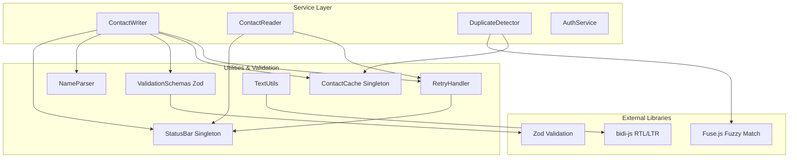

# POC Issues Resolution - Execution Plan

## Overview

This plan addresses 22 identified issues in the Google People API POC, implementing validation improvements, retry logic, caching, fuzzy matching, accessibility features, and comprehensive testing while ensuring Windows compatibility.

## Architecture Changes

### New Dependencies

```bash
pnpm add zod fuse.js bidi-js cli-spinners
pnpm add -D vitest @vitest/ui
```

### New Classes/Modules

1. **ContactCache.ts** - Singleton cache with TTL (24 hours)
2. **RetryHandler.ts** - Retry logic for API calls (5 attempts, exponential backoff)
3. **StatusBar.ts** - Persistent bottom status bar for API counter display
4. **NameParser.ts** - Advanced name parsing with prefix/suffix detection
5. **ValidationSchemas.ts** - Zod schemas for email, phone, URL validation

### Architecture Diagram



## Implementation Details

### Phase 1: Core Infrastructure (Points 5, 6, 33, 37)

#### 1.1 Retry Handler with Status Bar Integration

**File**: `poc/src/utils/retryHandler.ts` (new)

```typescript
export class RetryHandler {
  private static readonly MAX_RETRIES = 5;
  private static readonly INITIAL_DELAY = 1000; // 1 second
  
  static async executeWithRetry<T>(
    operation: () => Promise<T>,
    operationName: string,
    apiType: 'read' | 'write'
  ): Promise<T> {
    let lastError: Error;
    
    for (let attempt = 1; attempt <= this.MAX_RETRIES; attempt++) {
      try {
        const result = await operation();
        // Track API call on success
        await ApiTracker.getInstance().track(apiType);
        return result;
      } catch (error) {
        lastError = error as Error;
        
        // Don't retry on non-transient errors (4xx except 429)
        if (this.isNonRetriableError(error)) {
          throw error;
        }
        
        if (attempt < this.MAX_RETRIES) {
          const delay = this.calculateBackoff(attempt);
          console.log(`Retry ${attempt}/${this.MAX_RETRIES} for ${operationName} after ${delay}ms...`);
          await this.sleep(delay);
        }
      }
    }
    
    throw new Error(`Failed after ${this.MAX_RETRIES} attempts: ${lastError.message}`);
  }
  
  private static isNonRetriableError(error: any): boolean {
    const statusCode = error?.response?.status || error?.code;
    // Retry on: network errors, 5xx, 429 (rate limit)
    // Don't retry: 4xx (except 429), auth errors
    if (!statusCode) return false;
    if (statusCode >= 500) return false; // Retriable
    if (statusCode === 429) return false; // Retriable
    if (statusCode >= 400 && statusCode < 500) return true; // Non-retriable
    return false;
  }
  
  private static calculateBackoff(attempt: number): number {
    return this.INITIAL_DELAY * Math.pow(2, attempt - 1); // Exponential: 1s, 2s, 4s, 8s, 16s
  }
}
```

#### 1.2 Contact Cache with TTL

**File**: `poc/src/utils/contactCache.ts` (new)

```typescript
export class ContactCache {
  private static instance: ContactCache;
  private cachedContacts: ContactData[] | null = null;
  private cacheTimestamp: number | null = null;
  private readonly TTL = 24 * 60 * 60 * 1000; // 24 hours in milliseconds
  
  private constructor() {}
  
  static getInstance(): ContactCache {
    if (!ContactCache.instance) {
      ContactCache.instance = new ContactCache();
    }
    return ContactCache.instance;
  }
  
  get(auth: OAuth2Client): Promise<ContactData[]> | null {
    if (!this.cachedContacts || !this.cacheTimestamp) {
      return null;
    }
    
    const now = Date.now();
    if (now - this.cacheTimestamp > this.TTL) {
      this.invalidate();
      return null;
    }
    
    return Promise.resolve(this.cachedContacts);
  }
  
  set(contacts: ContactData[]): void {
    this.cachedContacts = contacts;
    this.cacheTimestamp = Date.now();
  }
  
  invalidate(): void {
    this.cachedContacts = null;
    this.cacheTimestamp = null;
  }
}
```

#### 1.3 Persistent Status Bar

**File**: `poc/src/utils/statusBar.ts` (new)

```typescript
export class StatusBar {
  private static instance: StatusBar;
  private readCount = 0;
  private writeCount = 0;
  private isEnabled = true;
  
  static getInstance(): StatusBar {
    if (!StatusBar.instance) {
      StatusBar.instance = new StatusBar();
    }
    return StatusBar.instance;
  }
  
  updateCounts(read: number, write: number): void {
    this.readCount = read;
    this.writeCount = write;
    this.render();
  }
  
  private render(): void {
    if (!this.isEnabled) return;
    
    // Save cursor, move to bottom, clear line, print status, restore cursor
    const status = `[API Usage] Read: ${this.readCount} | Write: ${this.writeCount}`;
    process.stdout.write(`\x1b[s\x1b[999;0H\x1b[K${status}\x1b[u`);
  }
  
  hide(): void {
    this.isEnabled = false;
    // Clear bottom line
    process.stdout.write('\x1b[s\x1b[999;0H\x1b[K\x1b[u');
  }
  
  show(): void {
    this.isEnabled = true;
    this.render();
  }
}
```

#### 1.4 Windows Compatibility

**Updates needed**:
- `poc/src/utils/portManager.ts`: Replace `lsof -ti:${port}` with cross-platform solution using `netstat` for Windows
- Path handling: Already using `path.join()` which is cross-platform ✓
- File operations: Already using `fs/promises` which is cross-platform ✓

```typescript
// portManager.ts - Windows support
private static async findProcessOnPort(port: number): Promise<number | null> {
  try {
    const platform = process.platform;
    let command: string;
    
    if (platform === 'win32') {
      // Windows: netstat -ano | findstr :PORT
      command = `netstat -ano | findstr :${port}`;
    } else {
      // Unix: lsof -ti:PORT
      command = `lsof -ti:${port}`;
    }
    
    const { stdout } = await execAsync(command);
    
    if (platform === 'win32') {
      // Parse Windows netstat output to extract PID
      const lines = stdout.trim().split('\n');
      const match = lines[0]?.match(/\s+(\d+)\s*$/);
      return match ? parseInt(match[1], 10) : null;
    } else {
      const pid = parseInt(stdout.trim(), 10);
      return isNaN(pid) ? null : pid;
    }
  } catch {
    return null;
  }
}

private static async killProcessOnPort(port: number): Promise<void> {
  const pid = await this.findProcessOnPort(port);
  if (pid !== null) {
    try {
      const platform = process.platform;
      const killCommand = platform === 'win32' 
        ? `taskkill /F /PID ${pid}` 
        : `kill -9 ${pid}`;
      await execAsync(killCommand);
      console.log(`Process ${pid} killed successfully.`);
      await new Promise(resolve => setTimeout(resolve, 1000));
    } catch (error) {
      console.error(`Failed to kill process ${pid}:`, error);
    }
  }
}
```

### Phase 2: Validation Improvements (Points 3, 13, 14, 15, 35)

#### 2.1 Zod Validation Schemas

**File**: `poc/src/validators/validationSchemas.ts` (new)

```typescript
import { z } from 'zod';

export const ValidationSchemas = {
  email: z.string()
    .email('Invalid email address format')
    .max(254, 'Email address too long (max 254 characters)')
    .refine(
      (email) => !email.includes('..'),
      'Email cannot contain consecutive dots'
    ),
  
  phone: z.string()
    .regex(/^[\d+\-\s()]+$/, 'Only numbers, +, -, spaces, and parentheses allowed')
    .refine(
      (phone) => {
        const digits = phone.replace(/[^\d]/g, '');
        return digits.length >= 7 && digits.length <= 15;
      },
      'Phone must contain 7-15 digits'
    )
    .refine(
      (phone) => !/^[\s\-+()]+$/.test(phone),
      'Phone cannot be only special characters'
    ),
  
  linkedinUrl: z.string()
    .url('Invalid URL format')
    .refine(
      (url) => {
        try {
          const parsed = new URL(url.startsWith('http') ? url : `https://${url}`);
          const validHosts = ['linkedin.com', 'www.linkedin.com'];
          return validHosts.includes(parsed.hostname);
        } catch {
          return false;
        }
      },
      'Must be a valid LinkedIn URL'
    )
    .refine(
      (url) => {
        const parsed = new URL(url.startsWith('http') ? url : `https://${url}`);
        const validPaths = ['/in/', '/company/', '/school/'];
        return validPaths.some(path => parsed.pathname.includes(path));
      },
      'LinkedIn URL must contain a valid profile path (/in/, /company/, or /school/)'
    ),
  
  fieldLength: z.string()
    .max(1024, 'Field exceeds Google API limit of 1024 characters'),
  
  redirectPort: z.number()
    .int('Port must be an integer')
    .min(1024, 'Port must be >= 1024')
    .max(65535, 'Port must be <= 65535'),
};
```

#### 2.2 Update InputValidator to Use Zod

**File**: `poc/src/validators/inputValidator.ts`

Replace email, phone, URL validation methods with Zod schema validation:

```typescript
static validateEmail(email: string): string | true {
  const trimmed = email.trim();
  if (!trimmed) return true;
  
  const hebrewCheck = InputValidator.validateNoHebrew(trimmed);
  if (hebrewCheck !== true) return hebrewCheck;
  
  const result = ValidationSchemas.email.safeParse(trimmed);
  if (!result.success) {
    return result.error.errors[0].message;
  }
  
  return true;
}
```

#### 2.3 Google API Field Limits Validation

Add validation before creating contact in `contactWriter.ts`:

```typescript
private validateFieldLimits(data: EditableContactData): string | true {
  const fields = [
    data.firstName,
    data.lastName,
    data.company,
    data.jobTitle,
    ...data.emails,
    ...data.phones,
    data.linkedInUrl || ''
  ];
  
  // Check individual field length (1024 chars)
  for (const field of fields) {
    const result = ValidationSchemas.fieldLength.safeParse(field);
    if (!result.success) {
      return `Field too long: ${field.substring(0, 50)}... (max 1024 characters)`;
    }
  }
  
  // Check total field count (500 fields)
  const totalFields = 
    (data.firstName ? 1 : 0) +
    (data.lastName ? 1 : 0) +
    (data.company ? 1 : 0) +
    (data.jobTitle ? 1 : 0) +
    data.emails.length +
    data.phones.length +
    (data.linkedInUrl ? 1 : 0) +
    data.labelResourceNames.length;
  
  if (totalFields > 500) {
    return `Too many fields (${totalFields}). Google API allows maximum 500 fields per contact.`;
  }
  
  return true;
}
```

#### 2.4 Port Validation in Settings

**File**: `poc/src/settings.ts`

```typescript
const portEnv = process.env.REDIRECT_PORT || '3000';
const portResult = ValidationSchemas.redirectPort.safeParse(parseInt(portEnv, 10));

if (!portResult.success) {
  throw new Error(`Invalid REDIRECT_PORT: ${portResult.error.errors[0].message}`);
}

export const SETTINGS = {
  // ...
  REDIRECT_PORT: portResult.data,
  // ...
};
```

### Phase 3: Advanced Text Processing (Points 8, 16)

#### 3.1 Hebrew Text with bidi-js

**File**: `poc/src/utils/textUtils.ts`

```typescript
import bidi from 'bidi-js';

static reverseHebrewText(text: string): string {
  if (!text || !this.hasHebrewCharacters(text)) {
    return text;
  }
  
  // Use bidi-js for proper bidirectional text handling
  const bidiText = bidi(text);
  
  // bidi-js returns an array of tokens with direction info
  // Process and format for terminal display
  return bidiText;
}
```

#### 3.2 Advanced Name Parser

**File**: `poc/src/utils/nameParser.ts` (new)

```typescript
export class NameParser {
  private static readonly PREFIXES = [
    'dr', 'mr', 'mrs', 'ms', 'miss', 'prof', 'rev', 'hon', 
    'sir', 'lady', 'lord', 'dame', 'capt', 'col', 'gen', 'maj'
  ];
  
  private static readonly SUFFIXES = [
    'jr', 'sr', 'ii', 'iii', 'iv', 'v', 
    'phd', 'md', 'esq', 'cpa', 'dds', 'jd', 'pe', 'rn'
  ];
  
  static parseFullName(fullName: string): { firstName: string; lastName: string } {
    const trimmed = fullName.trim();
    const parts = trimmed.split(RegexPatterns.MULTIPLE_SPACES).filter(p => p);
    
    if (parts.length === 0) {
      return { firstName: '', lastName: '' };
    }
    
    // Remove prefixes from beginning
    while (parts.length > 0 && this.isPrefix(parts[0])) {
      parts.shift();
    }
    
    // Remove suffixes from end
    while (parts.length > 0 && this.isSuffix(parts[parts.length - 1])) {
      parts.pop();
    }
    
    if (parts.length === 0) {
      return { firstName: '', lastName: '' };
    }
    
    if (parts.length === 1) {
      return { firstName: parts[0], lastName: '' };
    }
    
    // First part is first name, rest is last name
    return {
      firstName: parts[0],
      lastName: parts.slice(1).join(' ')
    };
  }
  
  private static isPrefix(word: string): boolean {
    const normalized = word.toLowerCase().replace('.', '');
    return this.PREFIXES.includes(normalized);
  }
  
  private static isSuffix(word: string): boolean {
    const normalized = word.toLowerCase().replace('.', '');
    return this.SUFFIXES.includes(normalized);
  }
}
```

### Phase 4: Fuzzy Duplicate Detection (Point 17)

#### 4.1 Update DuplicateDetector with Fuse.js

**File**: `poc/src/services/duplicateDetector.ts`

```typescript
import Fuse from 'fuse.js';
import { ContactCache } from '../utils/contactCache.js';

export class DuplicateDetector {
  private readonly FUZZY_THRESHOLD = 0.2; // Strict matching
  
  constructor(private auth: OAuth2Client) {}
  
  async checkDuplicateName(firstName: string, lastName: string): Promise<DuplicateMatch[]> {
    const contacts = await this.fetchAllContacts();
    const fullName = `${firstName} ${lastName}`.trim().toLowerCase();
    
    // Use Fuse.js for fuzzy string matching
    const fuse = new Fuse(contacts, {
      keys: [
        { name: 'firstName', weight: 0.5 },
        { name: 'lastName', weight: 0.5 }
      ],
      threshold: this.FUZZY_THRESHOLD,
      ignoreLocation: true,
    });
    
    const results = fuse.search(fullName);
    
    return results.map(result => ({
      contact: result.item,
      similarityType: 'Full Name' as SimilarityType,
    }));
  }
  
  private async fetchAllContacts(): Promise<ContactData[]> {
    const cache = ContactCache.getInstance();
    const cached = cache.get(this.auth);
    
    if (cached) {
      return cached;
    }
    
    // Fetch from API with retry logic
    const contacts = await this.fetchContactsFromAPI();
    cache.set(contacts);
    return contacts;
  }
  
  clearCache(): void {
    ContactCache.getInstance().invalidate();
  }
}
```

### Phase 5: UX Improvements (Points 9, 11, 12, 24, 27, 28, 34)

#### 5.1 Disable "Create" Until Valid (Point 9)

**File**: `poc/src/services/contactWriter.ts`

In `showSummaryAndEdit()`, dynamically generate menu choices:

```typescript
private async showSummaryAndEdit(data: EditableContactData): Promise<EditableContactData> {
  let editableData = { ...data };
  
  while (true) {
    // ... display summary ...
    
    const validationResult = InputValidator.validateMinimumRequirements(editableData);
    const isValid = validationResult === true;
    
    const choices = [];
    
    if (isValid) {
      choices.push({ name: 'Create contact', value: 'create' });
    } else {
      choices.push({ 
        name: `Create contact (disabled: ${validationResult})`, 
        value: 'create_disabled',
        disabled: true 
      });
    }
    
    choices.push(
      { name: 'Edit labels', value: 'edit_labels' },
      // ... other options ...
    );
    
    const { action } = await inquirer.prompt([{ /* ... */ choices }]);
    
    if (action === 'create') {
      break;
    }
    // ...
  }
}
```

#### 5.2 Remove All Non-Null Assertions (Point 27)

Search for all `!` assertions and replace with proper null checks:

```typescript
// Before:
return response.data.resourceName!;

// After:
if (!response.data.resourceName) {
  throw new Error('API response missing resourceName');
}
return response.data.resourceName;
```

#### 5.3 Loading Indicators with ora (Point 28)

**File**: `poc/src/services/contactReader.ts`

```typescript
import ora from 'ora';

async displayContacts(): Promise<void> {
  const spinner = ora('Fetching contacts from Google People API...').start();
  
  try {
    const contacts = await this.readContacts((current, total) => {
      spinner.text = `Fetching contacts... ${current}/${total || '?'}`;
    });
    
    spinner.succeed(`Found ${contacts.length.toLocaleString('en-US')} contacts`);
    this.displayContactList(contacts);
  } catch (error) {
    spinner.fail('Failed to fetch contacts');
    throw error;
  }
}

private async readContacts(
  onProgress?: (current: number, total?: number) => void
): Promise<ContactData[]> {
  // ... inside pagination loop:
  onProgress?.(contacts.length, undefined);
  // ...
}
```

#### 5.4 OAuth Timeout (Point 12)

**File**: `poc/src/services/authService.ts`

```typescript
private async getNewToken(): Promise<void> {
  const OAUTH_TIMEOUT = 10 * 60 * 1000; // 10 minutes
  
  const timeoutPromise = new Promise<never>((_, reject) => {
    setTimeout(() => {
      reject(new Error('OAuth authentication timeout after 10 minutes'));
    }, OAUTH_TIMEOUT);
  });
  
  return Promise.race([
    this.startAuthServer(),
    timeoutPromise
  ]);
}
```

#### 5.5 Consistent Empty Values (Point 24)

Replace all `'(empty)'` displays with `''`:

```typescript
// Before:
console.log(`-Company: ${editableData.company || '(empty)'}`);

// After:
console.log(`-Company: ${editableData.company || ''}`);
```

#### 5.6 Accessibility - Verbose Mode (Point 34)

**File**: `poc/src/index.ts`

```typescript
// Parse CLI args
const args = process.argv.slice(2);
const isVerbose = args.includes('--verbose');

if (isVerbose) {
  // Set global flag
  process.env.VERBOSE_MODE = 'true';
}
```

**File**: `poc/src/services/contactReader.ts`

```typescript
private displayContact(contact: ContactData, index: number, total: number): void {
  const isVerbose = process.env.VERBOSE_MODE === 'true';
  
  if (isVerbose) {
    // Accessible text-only format
    console.log(`Person ${index + 1} of ${total}`);
    console.log(`Labels: ${contact.label || 'none'}`);
    console.log(`Company: ${contact.company || 'none'}`);
    console.log(`First Name: ${contact.firstName || 'none'}`);
    console.log(`Last Name: ${contact.lastName || 'none'}`);
    // ... more fields ...
  } else {
    // Current compact format with Unicode
    console.log(`===Person ${personNum}/${totalNum}===`);
    // ... existing display ...
  }
}
```

Update `poc/package.json`:

```json
"scripts": {
  "start": "tsx src/index.ts",
  "start:verbose": "tsx src/index.ts --verbose",
  "dev": "tsx watch src/index.ts"
}
```

### Phase 6: Testing (Point 30)

#### 6.1 Vitest Configuration

**File**: `poc/vitest.config.ts` (new)

```typescript
import { defineConfig } from 'vitest/config';

export default defineConfig({
  test: {
    globals: true,
    environment: 'node',
    coverage: {
      provider: 'v8',
      reporter: ['text', 'html', 'lcov'],
      exclude: ['dist/**', 'node_modules/**', '**/*.test.ts']
    }
  }
});
```

#### 6.2 Test Structure

Create test files for each utility/validator:

**Files to create**:
- `poc/src/validators/__tests__/inputValidator.test.ts`
- `poc/src/validators/__tests__/validationSchemas.test.ts`
- `poc/src/utils/__tests__/nameParser.test.ts`
- `poc/src/utils/__tests__/textUtils.test.ts`
- `poc/src/utils/__tests__/retryHandler.test.ts`
- `poc/src/utils/__tests__/contactCache.test.ts`
- `poc/src/utils/__tests__/portManager.test.ts`

**Example test** (validationSchemas.test.ts):

```typescript
import { describe, it, expect } from 'vitest';
import { ValidationSchemas } from '../validationSchemas';

describe('ValidationSchemas', () => {
  describe('email', () => {
    it('should validate correct email addresses', () => {
      expect(ValidationSchemas.email.safeParse('user@example.com').success).toBe(true);
      expect(ValidationSchemas.email.safeParse('test.user@domain.co.uk').success).toBe(true);
    });
    
    it('should reject invalid emails', () => {
      expect(ValidationSchemas.email.safeParse('not-an-email').success).toBe(false);
      expect(ValidationSchemas.email.safeParse('user..name@example.com').success).toBe(false);
      expect(ValidationSchemas.email.safeParse('.user@example.com').success).toBe(false);
    });
    
    it('should reject emails longer than 254 characters', () => {
      const longEmail = 'a'.repeat(250) + '@example.com';
      expect(ValidationSchemas.email.safeParse(longEmail).success).toBe(false);
    });
  });
  
  describe('phone', () => {
    it('should validate phone numbers with 7-15 digits', () => {
      expect(ValidationSchemas.phone.safeParse('+1-555-0123').success).toBe(true);
      expect(ValidationSchemas.phone.safeParse('(555) 123-4567').success).toBe(true);
    });
    
    it('should reject phones with too few or too many digits', () => {
      expect(ValidationSchemas.phone.safeParse('123456').success).toBe(false);
      expect(ValidationSchemas.phone.safeParse('1234567890123456').success).toBe(false);
    });
    
    it('should reject phones with only special characters', () => {
      expect(ValidationSchemas.phone.safeParse('+++---').success).toBe(false);
      expect(ValidationSchemas.phone.safeParse('((((').success).toBe(false);
    });
  });
});
```

Update `poc/package.json`:

```json
"scripts": {
  "test": "vitest run",
  "test:watch": "vitest",
  "test:coverage": "vitest run --coverage"
}
```

### Phase 7: Documentation Updates (Point 31)

#### 7.1 Update README

**File**: `poc/README.md`

Update project structure section:

```markdown
## Project Structure

poc/
├── src/
│   ├── index.ts                    # Main entry point
│   ├── config.ts                   # Environment configuration
│   ├── settings.ts                 # Application settings
│   ├── types.ts                    # TypeScript interfaces
│   ├── services/                   # Service layer
│   │   ├── authService.ts          # OAuth authentication
│   │   ├── contactReader.ts        # Read contacts
│   │   ├── contactWriter.ts        # Create contacts
│   │   ├── duplicateDetector.ts    # Fuzzy duplicate detection
│   │   └── apiTracker.ts           # API usage tracking
│   ├── validators/                 # Input validation
│   │   ├── inputValidator.ts       # Custom validators
│   │   └── validationSchemas.ts    # Zod schemas
│   └── utils/                      # Utilities
│       ├── textUtils.ts            # Text processing
│       ├── nameParser.ts           # Name parsing with title detection
│       ├── regexPatterns.ts        # Regex patterns
│       ├── portManager.ts          # Port management (cross-platform)
│       ├── retryHandler.ts         # API retry logic
│       ├── contactCache.ts         # Contact caching with TTL
│       └── statusBar.ts            # Persistent status bar
├── docs/                           # Documentation
└── package.json
```

Add new sections:

```markdown
## Features

- Read and display contacts with persistent API usage counter
- Add contacts with comprehensive validation (email, phone, URL via Zod)
- Fuzzy duplicate detection using Fuse.js
- Automatic retry logic for transient failures (5 attempts)
- Cross-platform support (macOS, Linux, Windows)
- Accessibility mode with `--verbose` flag
- 24-hour contact caching for performance
- Loading indicators with progress updates

## Validation

The application uses Zod schemas for robust validation:
- Emails: RFC-compliant, max 254 chars
- Phones: 7-15 digits, international format support
- LinkedIn URLs: Strict hostname and path validation
- Field limits: 1024 chars per field, 500 fields per contact (Google API limits)

## Testing

Run tests with:
- `pnpm test` - Run all tests
- `pnpm test:watch` - Watch mode
- `pnpm test:coverage` - Coverage report

## Accessibility

Run in verbose mode for screen reader compatibility:
```
pnpm start:verbose
```
```

#### 7.2 Create Windows Setup Guide

**File**: `poc/docs/WINDOWS_SETUP.md` (new)

```markdown
# Windows Setup Guide

This guide covers Windows-specific setup and known differences.

## Prerequisites

- Node.js 18+ (download from nodejs.org)
- pnpm (install via: `npm install -g pnpm`)

## Port Management

The application automatically detects and kills processes on port 3000 using:
- macOS/Linux: `lsof`
- Windows: `netstat` and `taskkill`

No manual configuration needed.

## Known Issues

### PowerShell Execution Policy

If you encounter execution policy errors, run:
```powershell
powershell -ExecutionPolicy Bypass -File script.ps1
```

### Terminal Colors

Some Windows terminals may not support ANSI escape sequences. 
Use Windows Terminal (recommended) or enable ANSI support in Command Prompt.

## Testing

Run tests normally:
```bash
pnpm test
```
```

#### 7.3 Create Validation Documentation

**File**: `poc/docs/VALIDATION_RULES.md` (new)

Document all validation rules, examples, and edge cases.

## Implementation Order

1. **Dependencies** - Install all packages (5 min)
2. **Core Utils** - RetryHandler, ContactCache, StatusBar (30 min)
3. **Windows Compatibility** - Update portManager.ts (20 min)
4. **Validation** - Zod schemas, update InputValidator (45 min)
5. **Name Parsing** - NameParser with prefix/suffix detection (30 min)
6. **Hebrew Text** - bidi-js integration (20 min)
7. **Fuzzy Matching** - Update DuplicateDetector with Fuse.js (30 min)
8. **UX Improvements** - Loading, timeouts, verbose mode (45 min)
9. **Service Updates** - Integrate retry logic and cache (60 min)
10. **Testing** - Write unit tests for all new modules (90 min)
11. **Documentation** - Update README, create guides (30 min)
12. **Integration Testing** - Manual testing of full flows (30 min)

**Total Estimated Time: 7-8 hours**

## Testing Checklist

- [ ] Email validation with Zod (valid and invalid cases)
- [ ] Phone validation (7-15 digits, special chars only)
- [ ] LinkedIn URL validation (hostname, path)
- [ ] Name parsing with titles (Dr., Jr., Ph.D., etc.)
- [ ] Retry logic (network failures, 5xx, 429)
- [ ] Cache TTL (24 hours expiry)
- [ ] Windows port detection and killing
- [ ] Fuzzy duplicate detection (threshold 0.2)
- [ ] Persistent status bar display
- [ ] Verbose mode accessibility
- [ ] OAuth 10-minute timeout
- [ ] Field length limits (1024 chars, 500 fields)
- [ ] All non-null assertions removed
- [ ] Hebrew text with bidi-js
- [ ] Loading indicators with ora

## Files to Create

New files (16):
1. `poc/src/utils/retryHandler.ts`
2. `poc/src/utils/contactCache.ts`
3. `poc/src/utils/statusBar.ts`
4. `poc/src/utils/nameParser.ts`
5. `poc/src/validators/validationSchemas.ts`
6. `poc/vitest.config.ts`
7. `poc/src/validators/__tests__/inputValidator.test.ts`
8. `poc/src/validators/__tests__/validationSchemas.test.ts`
9. `poc/src/utils/__tests__/nameParser.test.ts`
10. `poc/src/utils/__tests__/textUtils.test.ts`
11. `poc/src/utils/__tests__/retryHandler.test.ts`
12. `poc/src/utils/__tests__/contactCache.test.ts`
13. `poc/src/utils/__tests__/portManager.test.ts`
14. `poc/docs/WINDOWS_SETUP.md`
15. `poc/docs/VALIDATION_RULES.md`
16. `poc/docs/IMPLEMENTATION_PLAN_V2.md` (this document)

## Files to Modify

Existing files (12):
1. `poc/package.json` - Add dependencies and scripts
2. `poc/src/settings.ts` - Port validation, browser timeout
3. `poc/src/validators/inputValidator.ts` - Use Zod schemas
4. `poc/src/services/contactWriter.ts` - Retry, cache, validation, disable create
5. `poc/src/services/contactReader.ts` - Retry, loading indicators
6. `poc/src/services/duplicateDetector.ts` - Fuse.js, cache integration
7. `poc/src/services/authService.ts` - OAuth timeout
8. `poc/src/services/apiTracker.ts` - StatusBar integration
9. `poc/src/utils/portManager.ts` - Windows support
10. `poc/src/utils/textUtils.ts` - bidi-js for Hebrew, use NameParser
11. `poc/src/index.ts` - CLI args parsing for verbose mode
12. `poc/README.md` - Update structure and features

## Risk Mitigation

- **Breaking Changes**: All changes are additive; existing functionality preserved
- **Testing**: Comprehensive unit tests for new modules before integration
- **Rollback**: Git commits after each phase for easy rollback
- **Windows Testing**: Cannot test on Windows, but using well-documented cross-platform patterns
